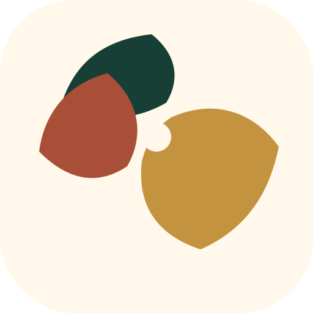
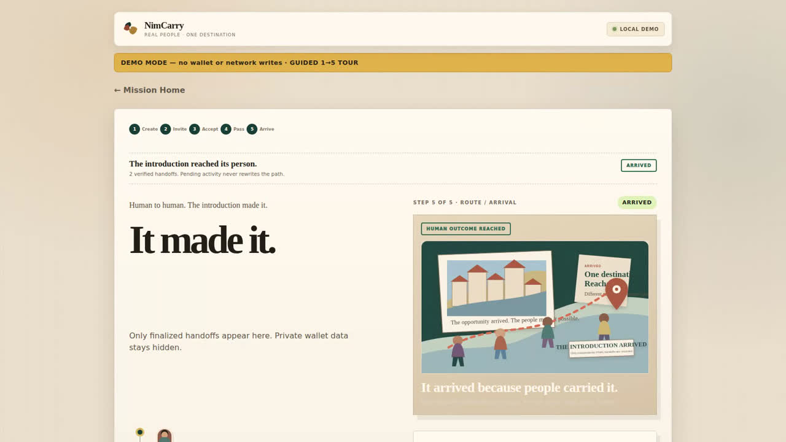
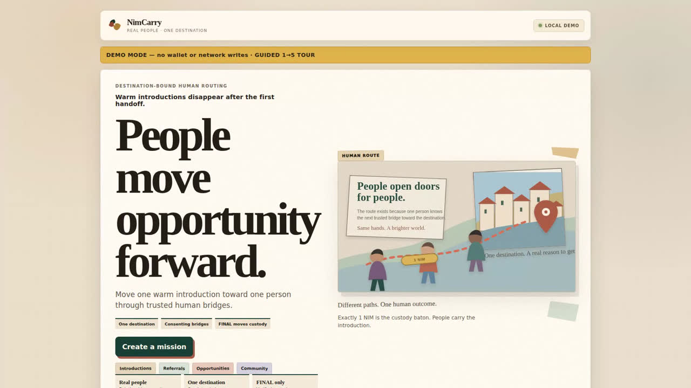
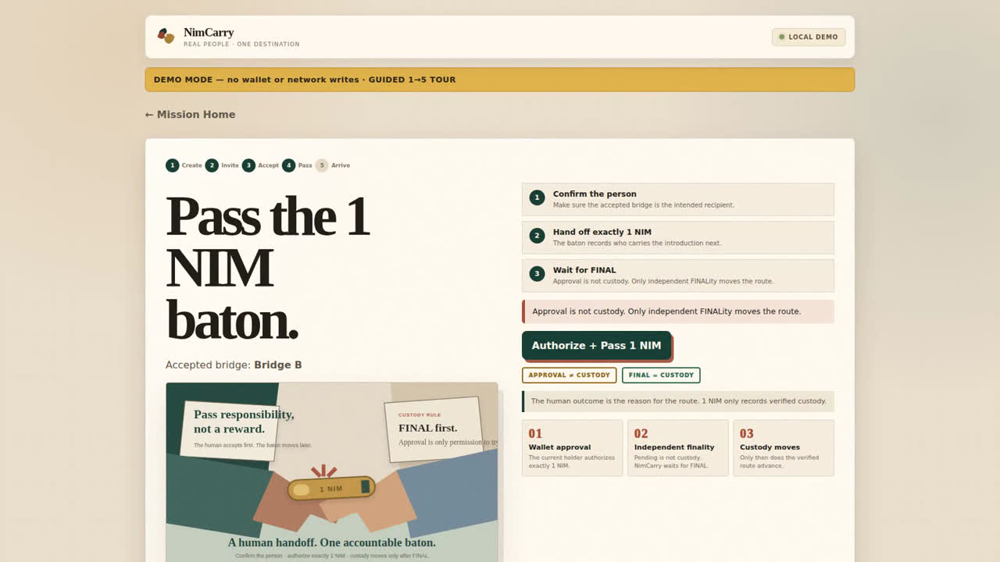

# NimCarry

> One NIM. One bridge at a time.

| Field | Value |
| --- | --- |
| Category | Social |
| Pricing | Free |
| Team name | NimCarry |
| Team members | Opeyemi |
| X account | Roy1919875 |
| Heard about it via | X |
| Contact email | bfaadil@gmail.com |
| GitHub login | @Faadil1 |
| Submitted at | 2026-09-14T12:09:32.232Z |

## Links

| Link | URL |
| --- | --- |
| Repo | [https://github.com/Faadil1/nimcarry](<https://github.com/Faadil1/nimcarry>) |
| Demo | [https://nimcarry.faadil-casecraft.workers.dev](<https://nimcarry.faadil-casecraft.workers.dev>) |
| Video | [https://youtu.be/SAyv8hyZG6Q](<https://youtu.be/SAyv8hyZG6Q>) |
| Skool post | [https://www.skool.com/miniappscompetition/nimcarry?p=2ff7724f](<https://www.skool.com/miniappscompetition/nimcarry?p=2ff7724f>) |
| Social post | [https://x.com/roy1919875/status/2099466096860397940?s=46&t=BwAG2C4pUXYtaNoGH2rwlw](<https://x.com/roy1919875/status/2099466096860397940?s=46&t=BwAG2C4pUXYtaNoGH2rwlw>) |

## Description

NimCarry turns a warm introduction into a destination-bound human route you can actually follow. Each consenting bridge passes exactly 1 NIM as a custody baton, and the route advances only after independently verified FINAL.

## Builder story

Warm introductions often disappear after the first handoff. Someone says “I’ll pass it on,” but from that point there is no shared way to know who is carrying the introduction or whether it ever reached the intended person. I built NimCarry to make that human route visible without turning the relationship into a reward system. Each bridge explicitly chooses to participate, exactly 1 NIM acts as the custody baton, and only independently verified FINAL transactions can move the route forward. The goal is simple: make trusted introductions trackable while keeping the destination private and the human relationship at the center.

## Thumbnail

## Screenshots

---

_Generated from the submission form. `submission.yaml` in this folder is the machine-readable source of truth._
