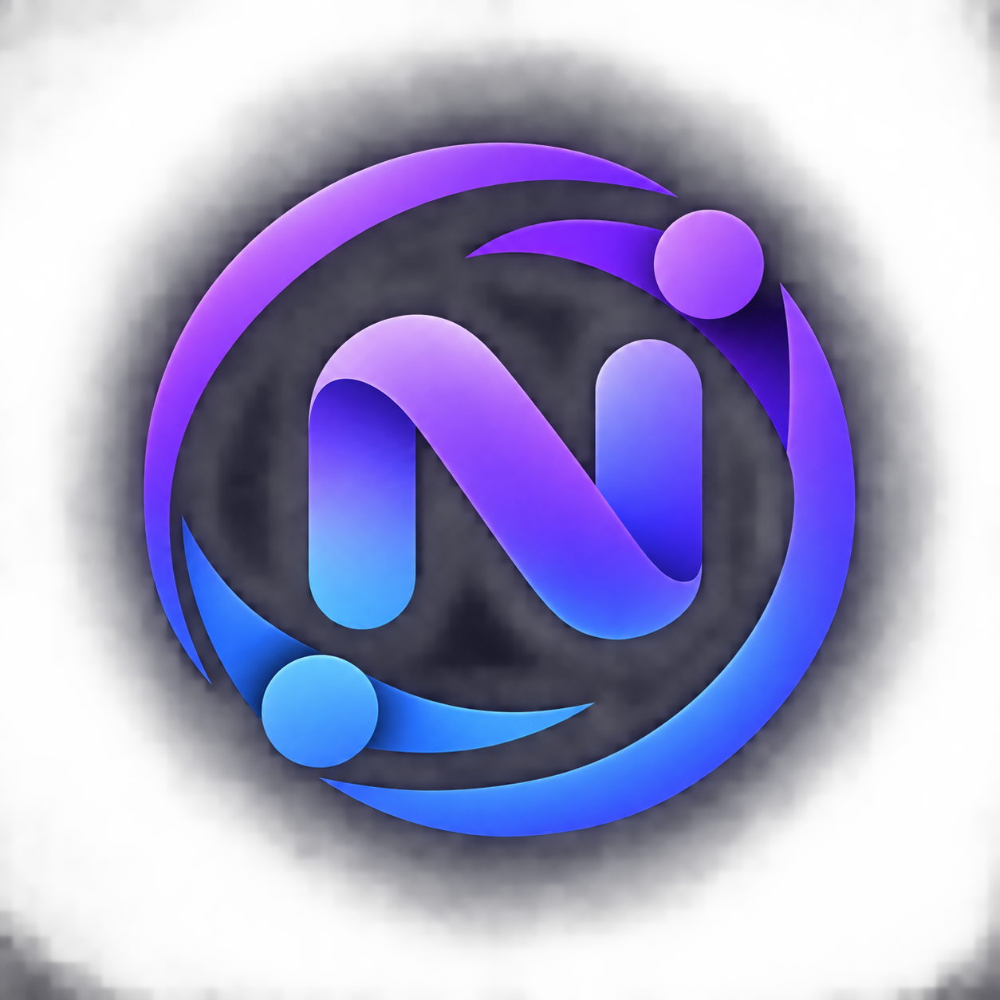
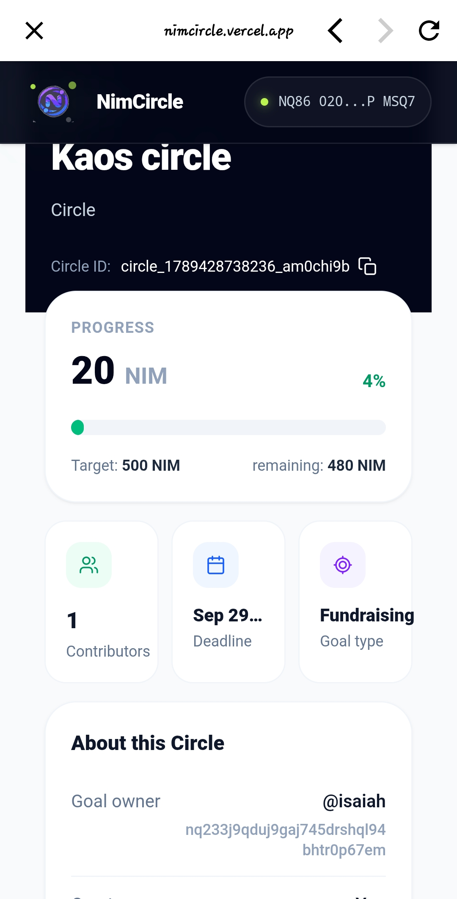
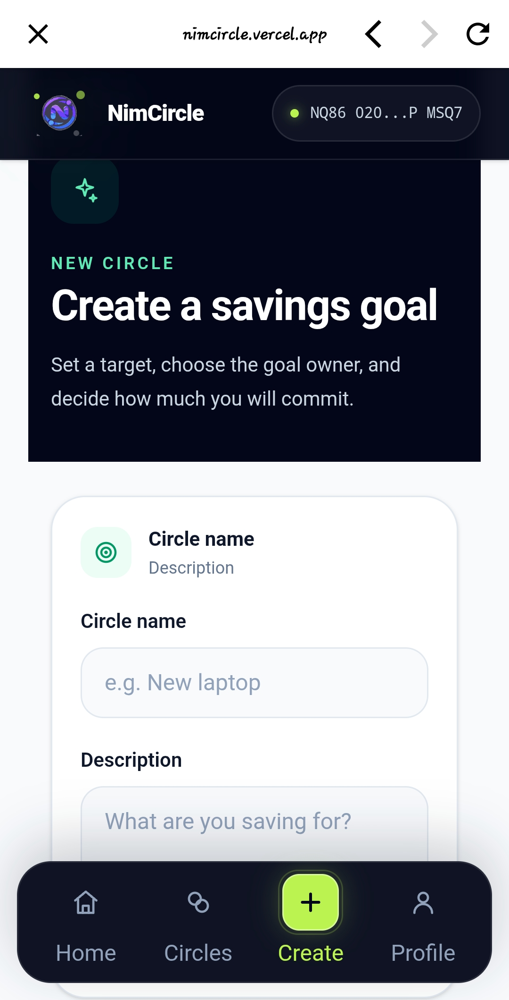
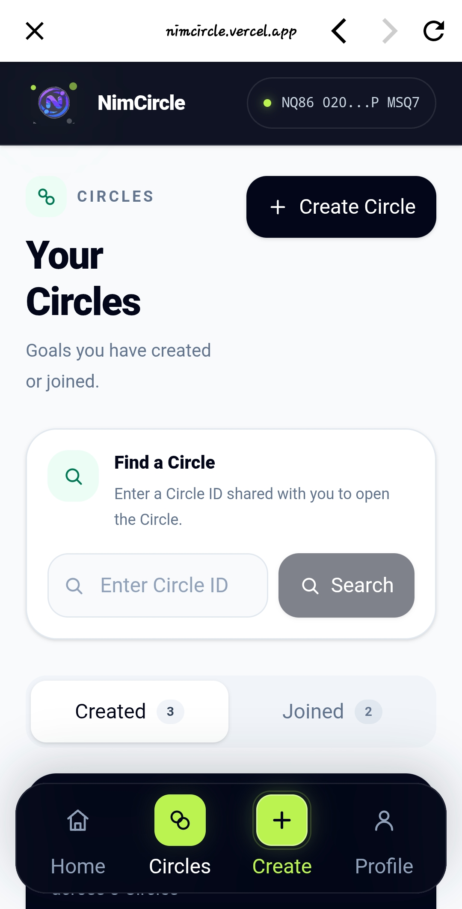
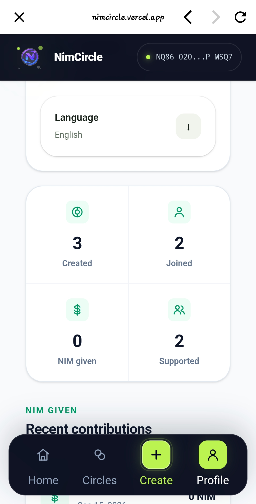
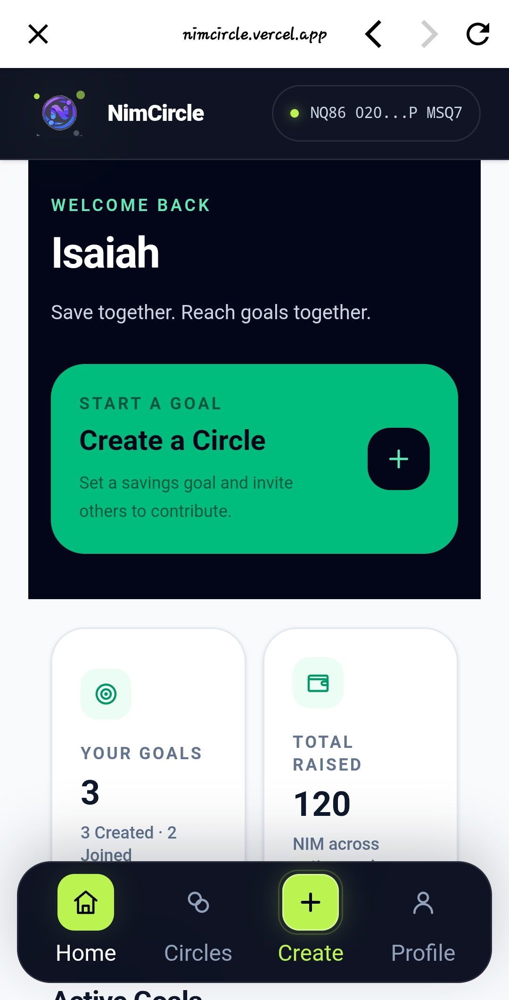

# NimCircle

> Shared savings goals powered by NIM.

| Field | Value |
| --- | --- |
| Category | Social |
| Pricing | Free |
| Team name | _Not provided — optional_ |
| Team members | _Not provided — optional_ |
| X account | https://x.com/De_Ice1 |
| Heard about it via | X |
| Contact email | klasikyemite04@gmail.com |
| GitHub login | @KAOS-CODM |
| Submitted at | 2026-09-15T10:37:21.459Z |

## Links

| Link | URL |
| --- | --- |
| Repo | [https://github.com/KAOS-CODM/nimcircle](<https://github.com/KAOS-CODM/nimcircle>) |
| Demo | [https://nimcircle.vercel.app](<https://nimcircle.vercel.app>) |
| Video | [https://youtu.be/xSEl5Qs-s1I](<https://youtu.be/xSEl5Qs-s1I>) |
| Skool post | _Not provided — optional_ |
| Social post | [https://x.com/De_Ice1/status/2099808640089706515?s=20](<https://x.com/De_Ice1/status/2099808640089706515?s=20>) |

## Description

NimCircle is a Nimiq Pay Mini App for coordinating shared savings goals with NIM.

Create a Circle with a target amount, deadline, and goal owner, then share its unique Circle ID with the people who should contribute. Participants can find the Circle, send NIM through Nimiq Pay

## Builder story

I built NimCircle around a simple problem: shared savings are often coordinated through group chats, spreadsheets, screenshots, and manual payment tracking.

I wanted to turn that informal process into a focused experience where the goal, contributors, progress, and payments all live in one Circle.

Nimiq made that especially interesting because NIM transactions are fast and feeless, while Nimiq Pay provides the wallet experience directly inside the Mini App. Instead of treating wallet integration as a feature added to the side, I made the transaction itself part of NimCircle's core workflow.

A major focus during development was making contributions verifiable. NimCircle does not simply trust the frontend after a transaction is submitted. The backend independently checks the transaction against the Circle's expected recipient, amount, memo, and contributor wallet before confirming it.

I also wanted the app to feel approachable beyond a single demo flow, so I built Personal and Fundraising Circles, contribution history, Circle discovery, lifecycle management, localization, and a mobile-first interface.

NimCircle is my attempt to make saving together with NIM feel simple, structured, and trustworthy.

## Thumbnail

## Screenshots

---

_Generated from the submission form. `submission.yaml` in this folder is the machine-readable source of truth._
