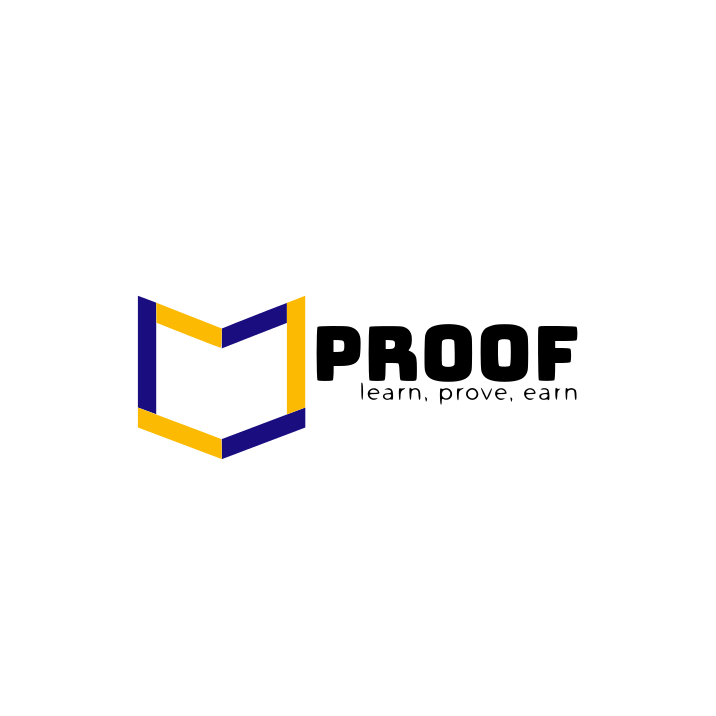
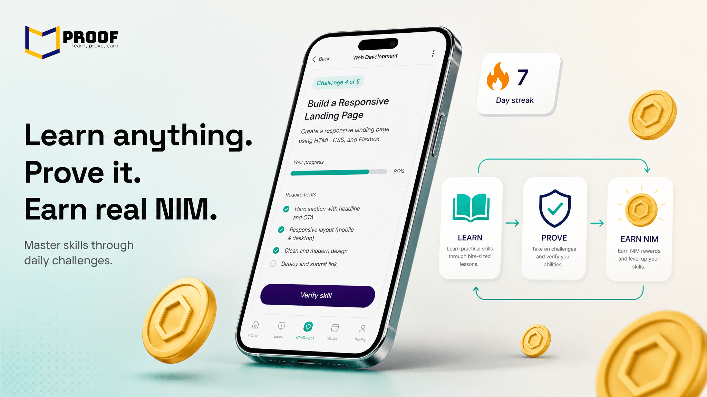
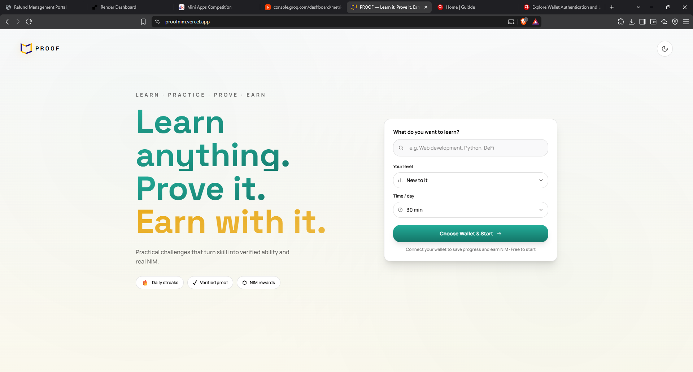
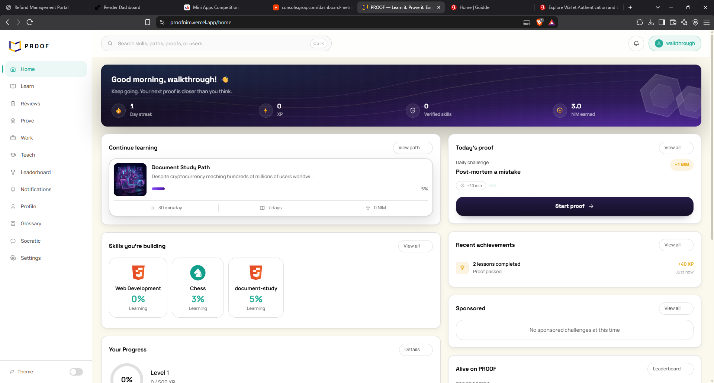
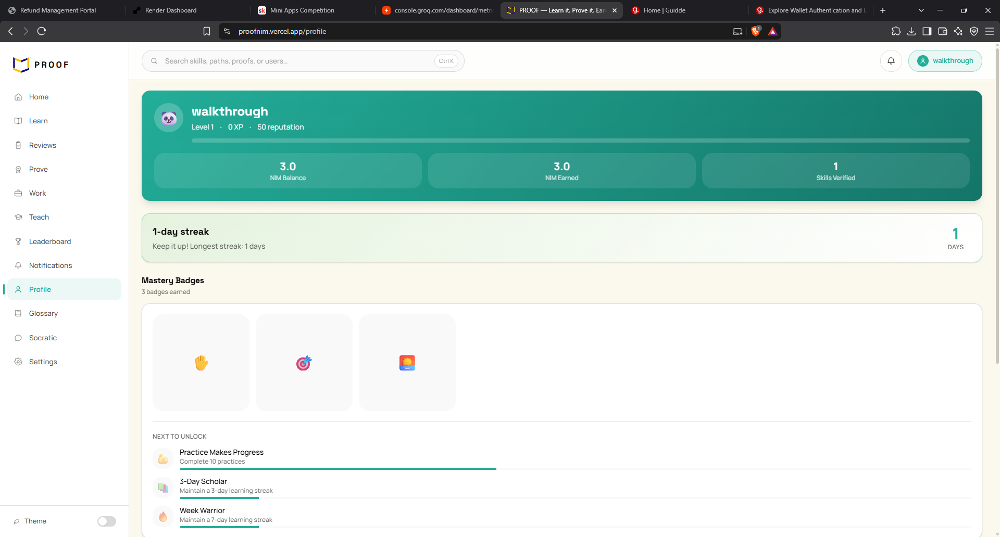
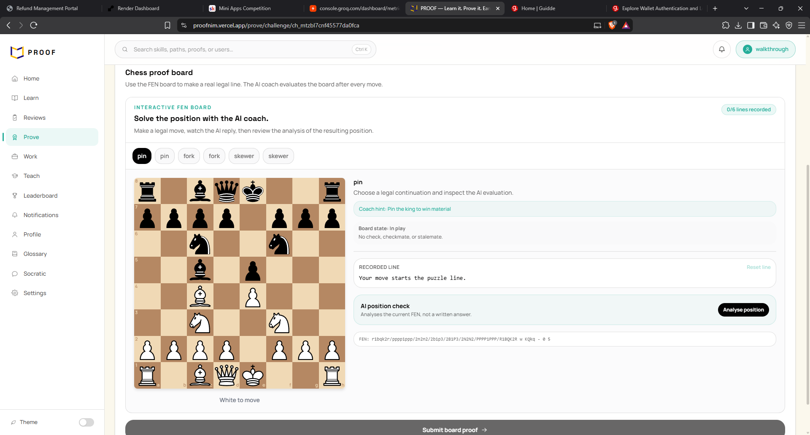

# PROOF

> Learn it, Prove it, Earn it.

| Field | Value |
| --- | --- |
| Category | Education |
| Pricing | Free |
| Team name | _Not provided — optional_ |
| Team members | _Not provided — optional_ |
| X account | nimiqagent |
| Heard about it via | x.com |
| Contact email | princecph4@gmail.com |
| GitHub login | @LegendaryTunzeverywhere |
| Submitted at | 2026-09-13T05:35:28.429Z |

## Links

| Link | URL |
| --- | --- |
| Repo | [https://github.com/LegendaryTunzeverywhere/PROOF](<https://github.com/LegendaryTunzeverywhere/PROOF>) |
| Demo | [https://youtu.be/IYAdBWNSW-A](<https://youtu.be/IYAdBWNSW-A>) |
| Video | [https://youtu.be/SsESRbMoURo](<https://youtu.be/SsESRbMoURo>) |
| Skool post | [https://www.skool.com/miniappscompetition/proof-is-live?p=9e9a7841](<https://www.skool.com/miniappscompetition/proof-is-live?p=9e9a7841>) |
| Social post | [https://x.com/NimiqAgent/status/2099008257461227894?s=20](<https://x.com/NimiqAgent/status/2099008257461227894?s=20>) |

## Description

Proof turns learning into demonstrated ability and earns NIM cryptocurrency rewards. AI-powered skill 
paths, real-world challenges, and verified proofs that unlock opportunities.

## Builder story

_Not provided — optional_

## Thumbnail

## Screenshots

---

_Generated from the submission form. `submission.yaml` in this folder is the machine-readable source of truth._
