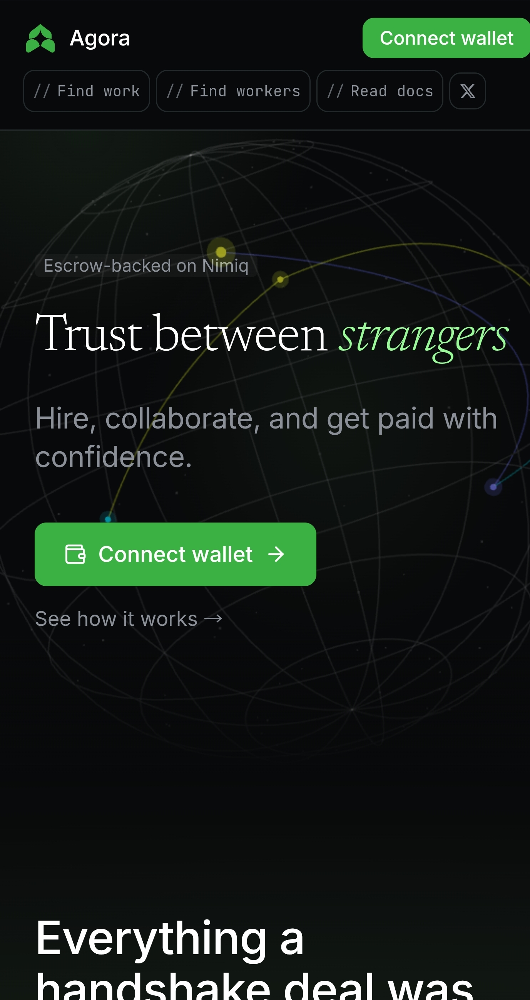
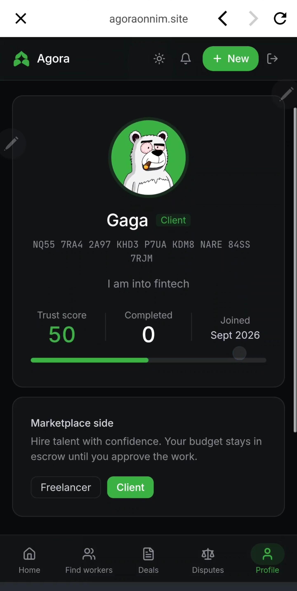
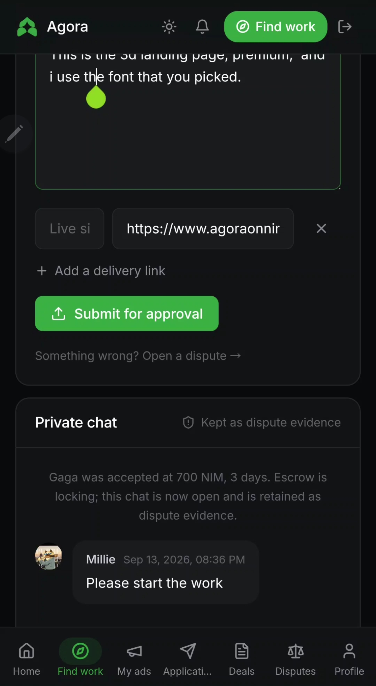
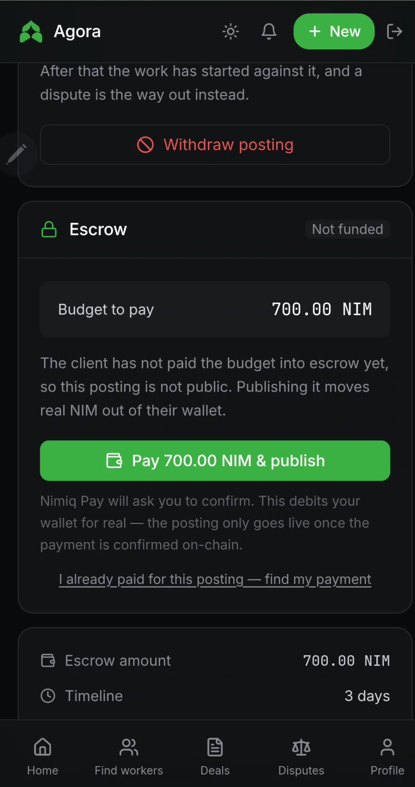
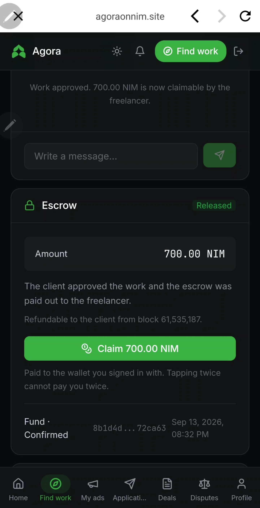

# Agora

> Hire, collaborate, and get paid with confidence.

| Field | Value |
| --- | --- |
| Category | Marketplaces |
| Pricing | Free |
| Team name | milliebanned |
| Team members | milliebanned |
| X account | milliebanned |
| Heard about it via | X |
| Contact email | semrush581@gmail.com |
| GitHub login | @Milliebanned |
| Submitted at | 2026-09-14T19:14:40.975Z |

## Links

| Link | URL |
| --- | --- |
| Repo | [https://github.com/Milliebanned/agora](<https://github.com/Milliebanned/agora>) |
| Demo | [https://www.agoraonnim.site/](<https://www.agoraonnim.site/>) |
| Video | [https://youtu.be/W8avTbwoE24?si=e5wtvtYZGaeEFhUN](<https://youtu.be/W8avTbwoE24?si=e5wtvtYZGaeEFhUN>) |
| Skool post | [https://www.skool.com/miniappscompetition/agora-official-launch-a-decentralized-p2p-marketplace-built-for-trust?p=6fc87fd6](<https://www.skool.com/miniappscompetition/agora-official-launch-a-decentralized-p2p-marketplace-built-for-trust?p=6fc87fd6>) |
| Social post | [https://x.com/Milliebanned/status/2099513518277951612?s=20](<https://x.com/Milliebanned/status/2099513518277951612?s=20>) |

## Description

It's for freelancers who are tired of writing proposals against budgets that may not exist, and for clients who want to hire a stranger without paying upfront on trust.

## Builder story

Agora is the greek word for marketplace. During the the time of ancient Greece, Agora served as place where people came for all sort of things, it even served as safe haven from all household stress to some Greek men. So, i want Agora p2p platform to represent that, a place people can come and trust one another for all sort of transactions. Many web2 centralised p2p platforms encroach people with their rules and fees, so here, we are offering both decentralisation and trust.

## Thumbnail

## Screenshots

---

_Generated from the submission form. `submission.yaml` in this folder is the machine-readable source of truth._
