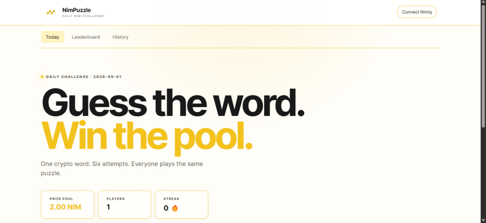
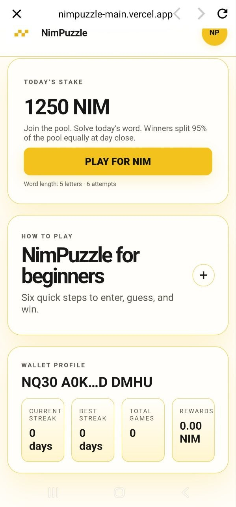
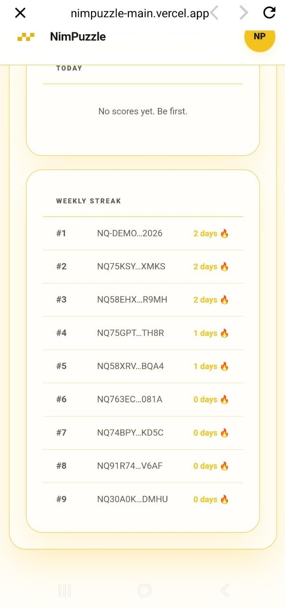
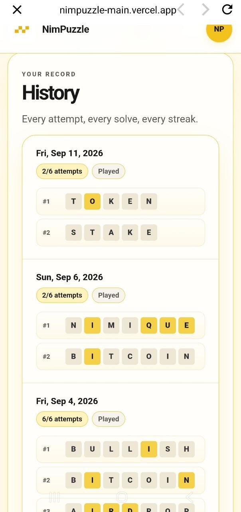
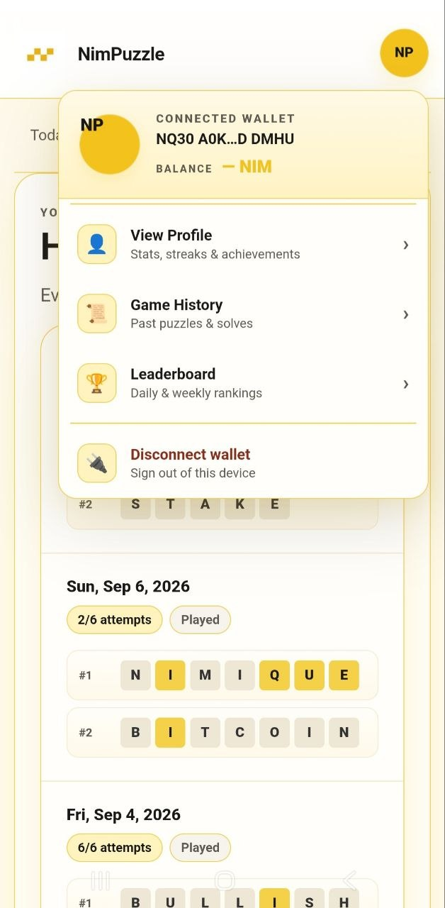
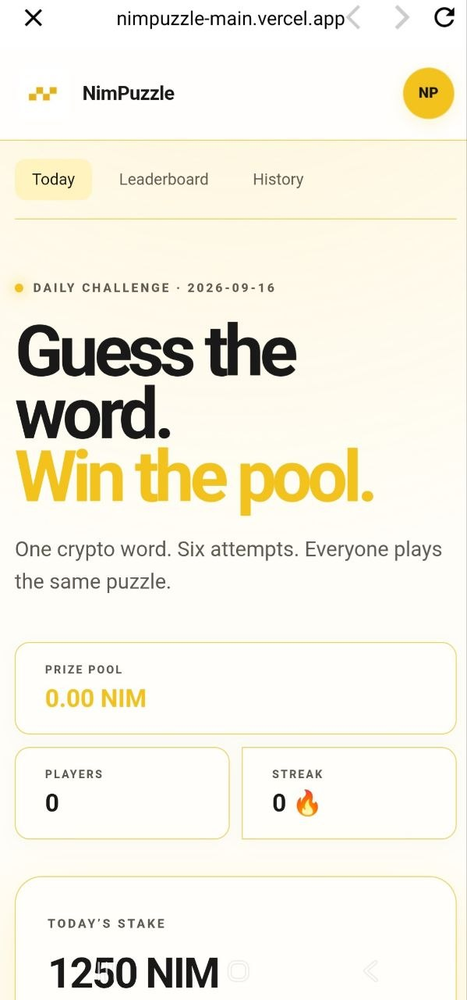

# NimPuzzle

> Guess the word. Stake NIM. Win the pool

| Field | Value |
| --- | --- |
| Category | Games |
| Pricing | Paid |
| Team name | _Not provided — optional_ |
| Team members | _Not provided — optional_ |
| X account | https://x.com/Crypt_marsh |
| Heard about it via | _Not provided — optional_ |
| Contact email | chideraugorjij@gmail.com |
| GitHub login | @TechGranny |
| Submitted at | 2026-09-16T10:28:34.447Z |

## Links

| Link | URL |
| --- | --- |
| Repo | [https://github.com/victorhez/nimpuzzle_main](<https://github.com/victorhez/nimpuzzle_main>) |
| Demo | [https://nimpuzzle-main.vercel.app](<https://nimpuzzle-main.vercel.app>) |
| Video | [https://youtu.be/To_Wwuw_504?si=MCSgkW2vFGpeZjLX](<https://youtu.be/To_Wwuw_504?si=MCSgkW2vFGpeZjLX>) |
| Skool post | [https://www.skool.com/miniappscompetition/nimpuzzle?p=a8a372a2](<https://www.skool.com/miniappscompetition/nimpuzzle?p=a8a372a2>) |
| Social post | [https://x.com/Crypt_marsh/status/2095487481000956269](<https://x.com/Crypt_marsh/status/2095487481000956269>) |

## Description

NimPuzzle is a daily crypto word game built for Nimiq Pay. Stake NIM, solve a new Web3-themed word in 6 attempts, build your streak, climb the leaderboard, and compete for the daily prize pool.

## Builder story

_Not provided — optional_

## Thumbnail

## Screenshots

---

_Generated from the submission form. `submission.yaml` in this folder is the machine-readable source of truth._
