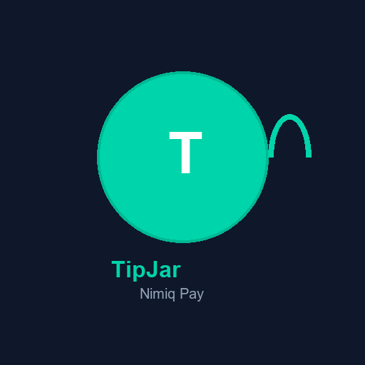
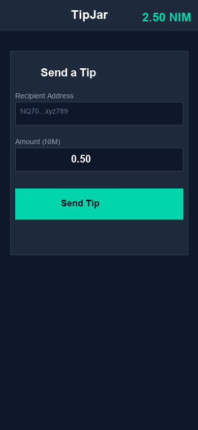

# Nimiq TipJar

> Send micro-tips in NIM directly inside Nimiq Pay with one click.

| Field | Value |
| --- | --- |
| Category | Social |
| Pricing | Free |
| Team name | _Not provided — optional_ |
| Team members | _Not provided — optional_ |
| X account | _Not provided — optional_ |
| Heard about it via | Nimiq Community |
| Contact email | 2383844705@qq.com |
| GitHub login | @Zhiyilang074811 |
| Submitted at | 2026-09-13T16:56:35.458Z |

## Links

| Link | URL |
| --- | --- |
| Repo | [https://github.com/Zhiyilang074811/nimiq-tipjar](<https://github.com/Zhiyilang074811/nimiq-tipjar>) |
| Demo | [https://zhiyilang074811.github.io/nimiq-tipjar/](<https://zhiyilang074811.github.io/nimiq-tipjar/>) |
| Video | [https://vimeo.com/1226478465](<https://vimeo.com/1226478465>) |
| Skool post | _Not provided — optional_ |
| Social post | _Not provided — optional_ |

## Description

Nimiq TipJar is a mini app built on the Nimiq Mini App SDK. Connect your wallet, view your balance, send tips to any address, and track history — all inside Nimiq Pay.

## Builder story

I am a CSDN blogger with 3000+ followers, building at the intersection of AI and Web3. This project was created using AI tools (Claude, Cursor) to demonstrate how accessible blockchain development has become. TipJar solves the friction in micro-tipping by integrating directly with Nimiq Pay - no copy-pasting addresses, no switching apps, just one-click tips.

## Thumbnail

## Screenshots

---

_Generated from the submission form. `submission.yaml` in this folder is the machine-readable source of truth._
