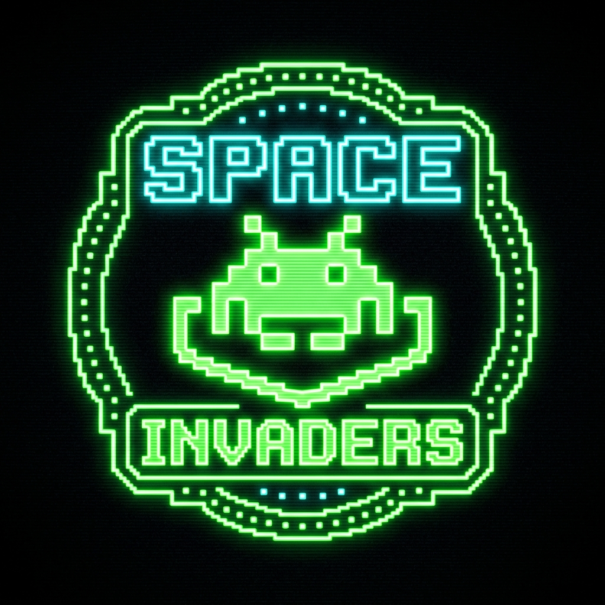
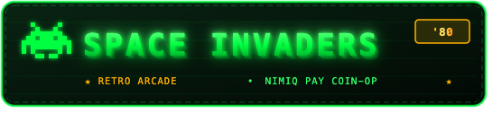
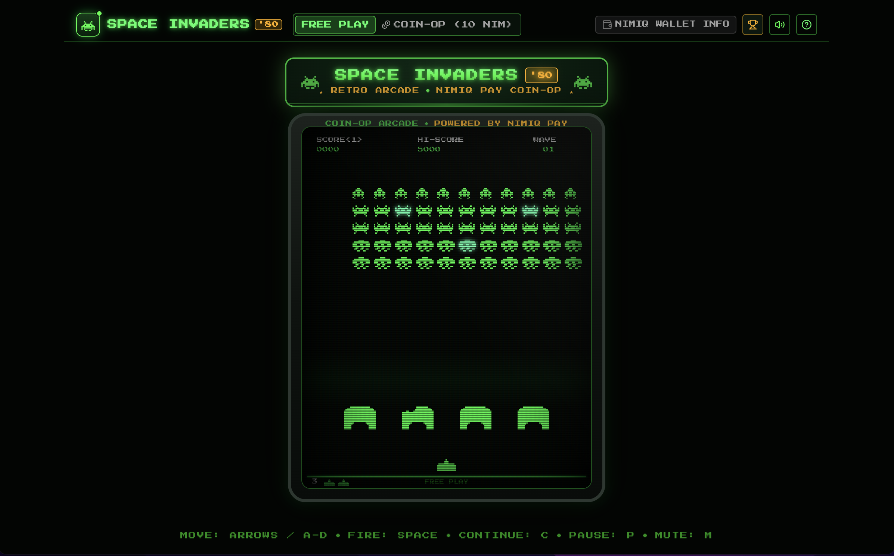
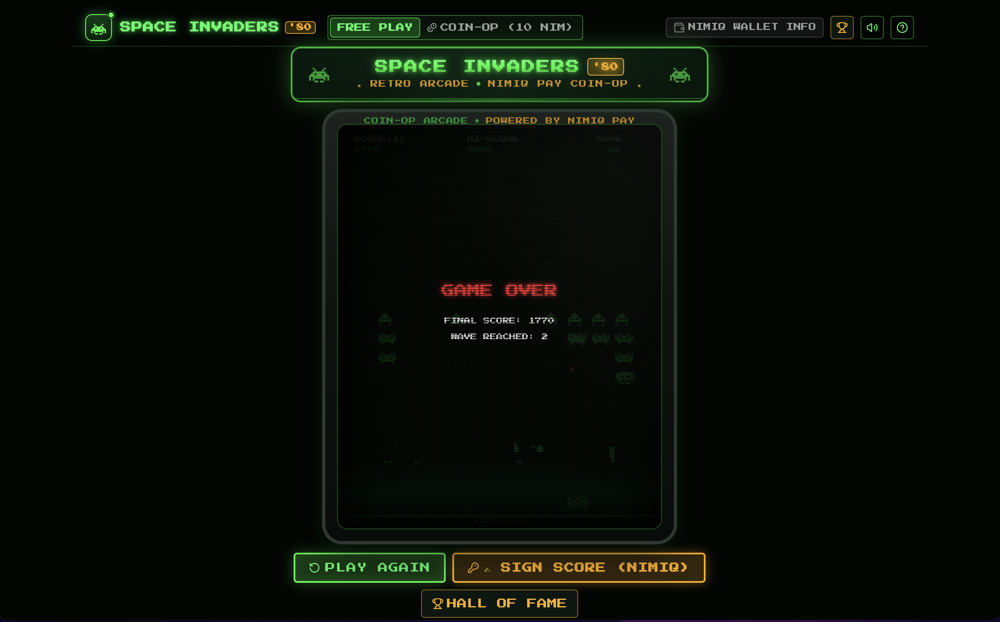
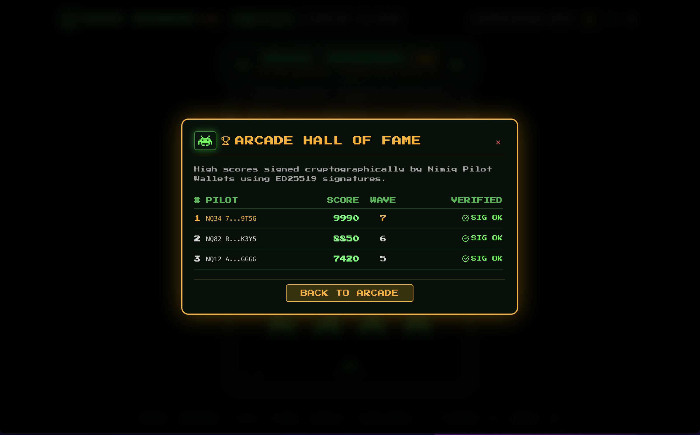

# Space Invaders

> Insert NIM. Blast Aliens. Own the High Score.

| Field | Value |
| --- | --- |
| Category | Games |
| Pricing | Freemium |
| Team name | _Not provided — optional_ |
| Team members | _Not provided — optional_ |
| X account | _Not provided — optional_ |
| Heard about it via | _Not provided — optional_ |
| Contact email | aoki91460@gmail.com |
| GitHub login | @aoki-non |
| Submitted at | 2026-09-13T18:58:24.342Z |

## Links

| Link | URL |
| --- | --- |
| Repo | [https://github.com/aoki-non/space-invader-nim](<https://github.com/aoki-non/space-invader-nim>) |
| Demo | [https://space-invader-nim.vercel.app](<https://space-invader-nim.vercel.app>) |
| Video | [https://youtu.be/mv8oBSEx3wY](<https://youtu.be/mv8oBSEx3wY>) |
| Skool post | _Not provided — optional_ |
| Social post | [https://x.com/sigma_dexx/status/2099210693413064771?s=46](<https://x.com/sigma_dexx/status/2099210693413064771?s=46>) |

## Description

Space Invaders ’80 brings the classic 1980s arcade cabinet as a mini app with authentic CRT visuals and instant 10 NIM coin-op credits via Nimiq Pay. Built for retro gaming fans and crypto players craving pure arcade action with seamless micro-payments.

## Builder story

_Not provided — optional_

## Thumbnail

## Screenshots

---

_Generated from the submission form. `submission.yaml` in this folder is the machine-readable source of truth._
