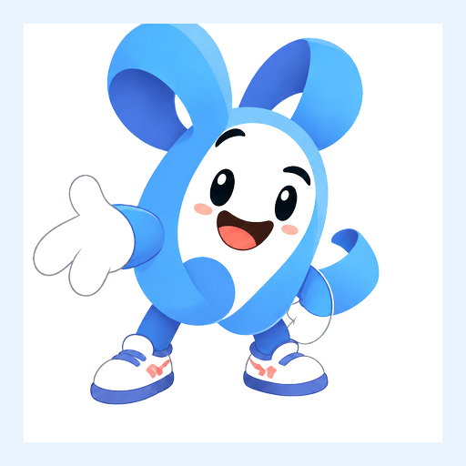
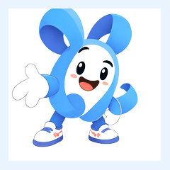
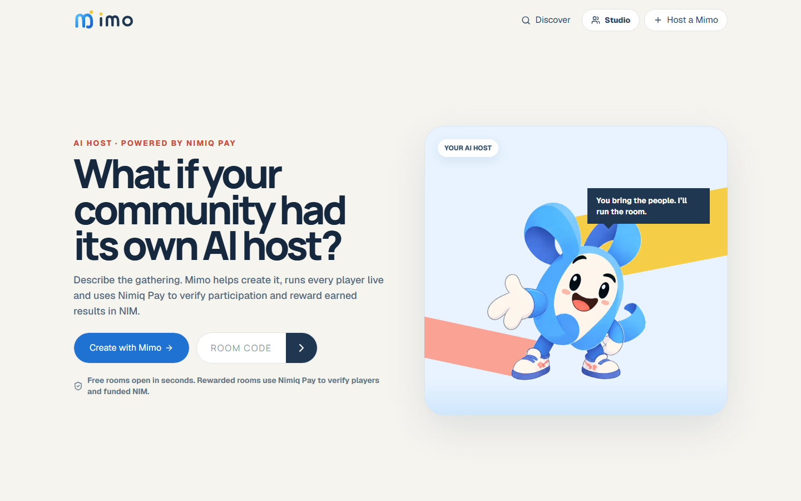
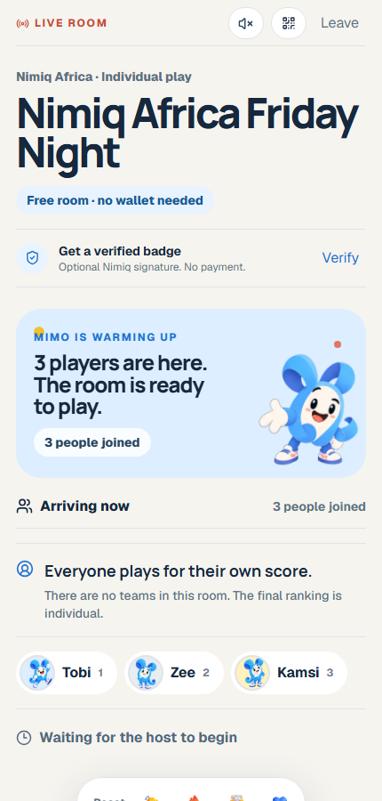
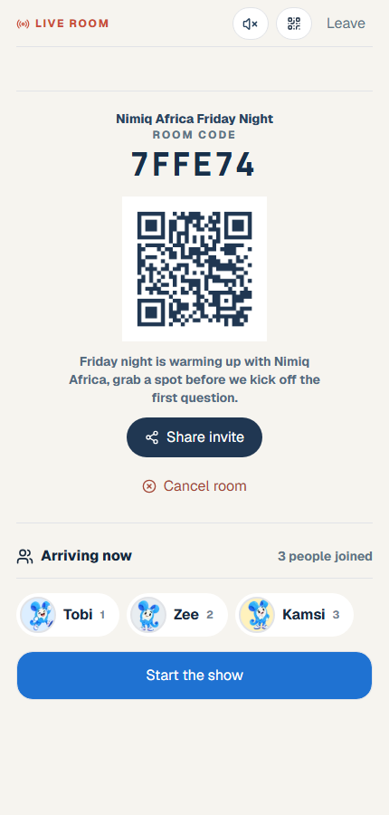
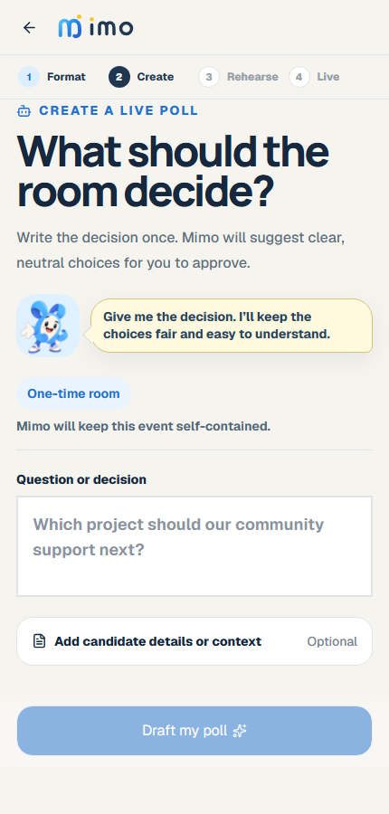

# Mimo

> The AI host that turns communities into live, participatory shows powered by Nimiq.

| Field | Value |
| --- | --- |
| Category | Social |
| Pricing | Free |
| Team name | Mimo |
| Team members | Miracle |
| X account | PlayMimoApp |
| Heard about it via | NimiQ community on X. |
| Contact email | flamingobuidl@gmail.com |
| GitHub login | @flamiinngo |
| Submitted at | 2026-09-15T15:31:36.552Z |

## Links

| Link | URL |
| --- | --- |
| Repo | [https://github.com/playmimoapp/mimo](<https://github.com/playmimoapp/mimo>) |
| Demo | [https://playmimo.xyz](<https://playmimo.xyz>) |
| Video | [https://youtu.be/2uKPb2glQEY](<https://youtu.be/2uKPb2glQEY>) |
| Skool post | [https://www.skool.com/miniappscompetition/meet-mimo-the-ai-host-that-makes-online-communities-playable?p=83b146bb](<https://www.skool.com/miniappscompetition/meet-mimo-the-ai-host-that-makes-online-communities-playable?p=83b146bb>) |
| Social post | [https://x.com/PlayMimoApp/status/2096859729725157382?s=20](<https://x.com/PlayMimoApp/status/2096859729725157382?s=20>) |

## Description

Mimo turns community gatherings into live experiences where everyone plays, votes and shapes the room together. Nimiq Pay proves wallet ownership and funds automatic NIM rewards from server verified results.

## Builder story

I built Mimo because online communities are full of people but most digital events still feel one-way. 

Whether a community gathers through Discord, X, a creator group or a local organisation, participation is usually split across calls, polls, forms and separate tools.

Mimo turns that gathering into one live experience. A host describes what they want, Mimo helps create it and then runs the room while people play, vote, respond and compete together.

The larger mission is to help expand the Nimiq ecosystem by giving communities outside it a practical and enjoyable reason to enter Nimiq Pay. 

A host can fund a declared NIM reward before an event. Mimo verifies the real transaction, locks the rules when play begins and automatically pays eligible winners from the funded vault after the server confirms the results.

Recurring events, community pages, seasons and standings make Mimo more than a one time campaign. 

It gives communities a reason to participate, discover Nimiq and keep returning.

## Thumbnail

## Screenshots

---

_Generated from the submission form. `submission.yaml` in this folder is the machine-readable source of truth._
