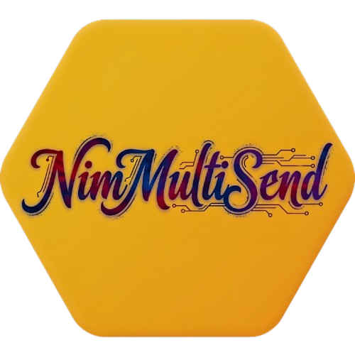
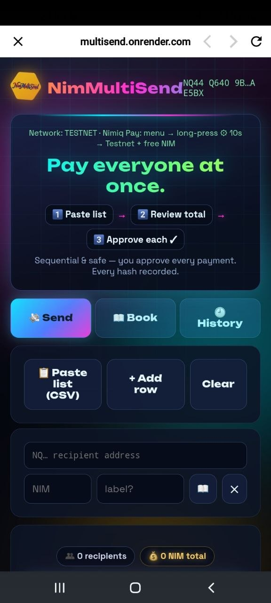
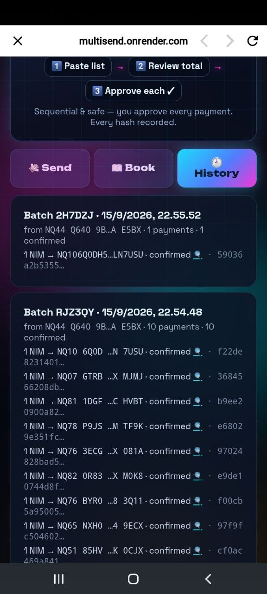
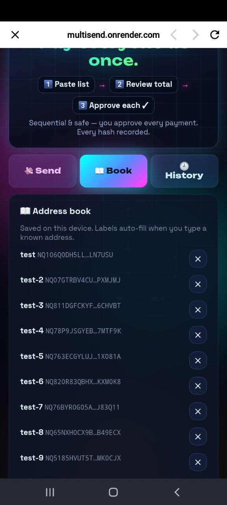
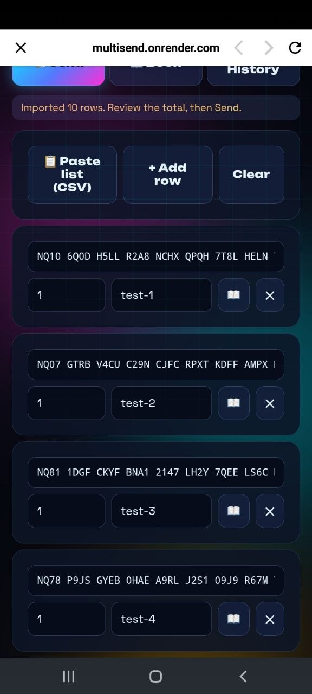

# NimMultiSend

> Pay everyone at once with NIM.

| Field | Value |
| --- | --- |
| Category | On-chain services |
| Pricing | Free |
| Team name | _Not provided — optional_ |
| Team members | _Not provided — optional_ |
| X account | cryptotudemun |
| Heard about it via | x |
| Contact email | anyonganying99@gmail.com |
| GitHub login | @lilrobin4 |
| Submitted at | 2026-09-15T16:17:45.337Z |

## Links

| Link | URL |
| --- | --- |
| Repo | [https://github.com/lilrobin4/multisend](<https://github.com/lilrobin4/multisend>) |
| Demo | [https://multisend.onrender.com](<https://multisend.onrender.com>) |
| Video | [https://youtube.com/shorts/k_QbfD2EoSs?si=FowfILcRANNfkqsV](<https://youtube.com/shorts/k_QbfD2EoSs?si=FowfILcRANNfkqsV>) |
| Skool post | [https://www.skool.com/miniappscompetition/nimmultisend-pay-everyone-at-once-with-nim?p=9275a923](<https://www.skool.com/miniappscompetition/nimmultisend-pay-everyone-at-once-with-nim?p=9275a923>) |
| Social post | [https://x.com/cryptotudemun/status/2099895301347983699?s=20](<https://x.com/cryptotudemun/status/2099895301347983699?s=20>) |

## Description

NimMultiSend is a batch-payment tool for Nimiq: paste a list of recipients, review the totals, and approve each payment in Nimiq Pay. Perfect for payrolls, community rewards, and splitting bills — non-custodial, with every hash recorded.

## Builder story

I kept running into the same annoyance: paying several people in NIM meant repeating the same send flow over and over — open wallet, paste address, type amount, confirm. For team payouts or community rewards, it was slow and easy to mistype an address.

So I built NimMultiSend: paste the whole list once, let the app validate every address and flag duplicates, review the totals, then approve each payment in Nimiq Pay. I deliberately made it non-custodial and sequential — the app never touches your funds, and every transaction gets its own approval and hash. I tested it end-to-end on testnet with a 10-recipient batch: all confirmed on-chain.

My goal is simple: make paying many people in NIM as easy as paying one.

## Thumbnail

## Screenshots

---

_Generated from the submission form. `submission.yaml` in this folder is the machine-readable source of truth._
