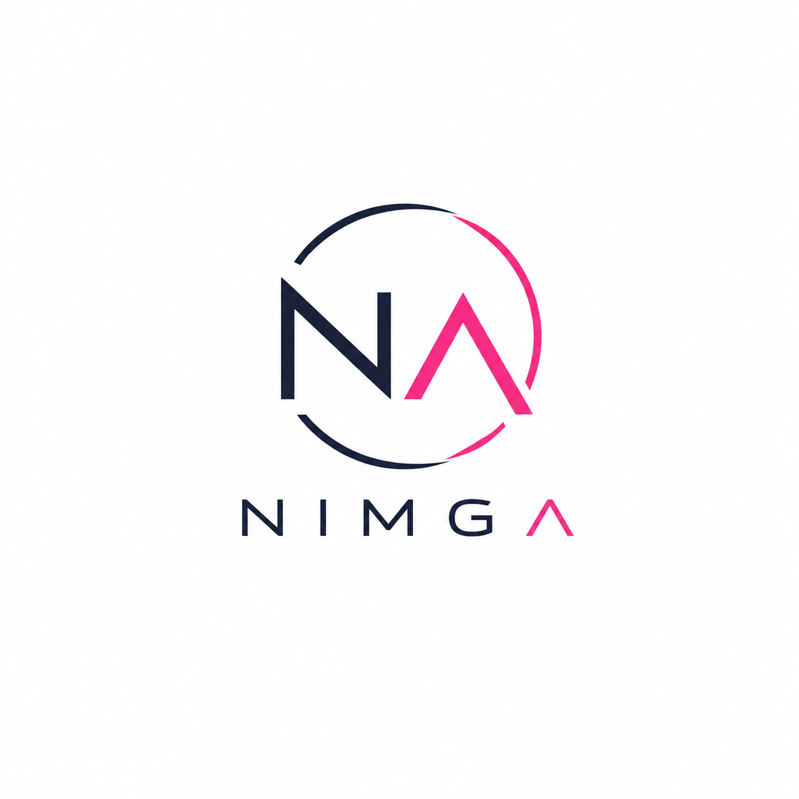
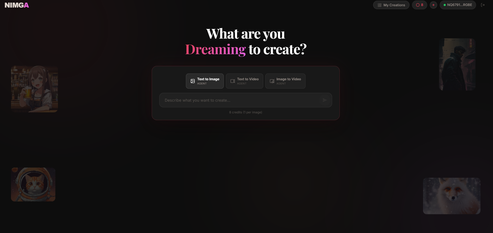
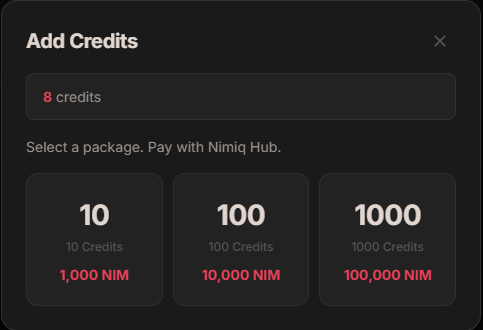
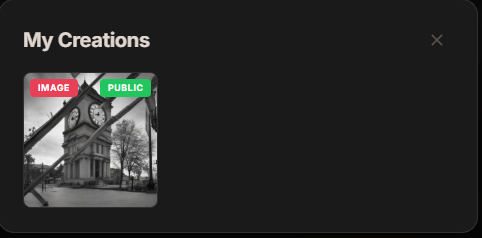

# NIMGA

> AI images and videos, powered by your Nimiq wallet.

| Field | Value |
| --- | --- |
| Category | Creator tools |
| Pricing | Freemium |
| Team name | _Not provided — optional_ |
| Team members | _Not provided — optional_ |
| X account | nimga_pics |
| Heard about it via | on X |
| Contact email | nazerbarkar@gmail.com |
| GitHub login | @nazerbarkar |
| Submitted at | 2026-09-14T14:51:34.442Z |

## Links

| Link | URL |
| --- | --- |
| Repo | [https://github.com/nazerbarkar/nimga](<https://github.com/nazerbarkar/nimga>) |
| Demo | [https://nimga.pics/](<https://nimga.pics/>) |
| Video | [https://youtu.be/T57ZeitYjO0](<https://youtu.be/T57ZeitYjO0>) |
| Skool post | [https://www.skool.com/miniappscompetition/nimga-ai-image-video-generation?p=fb9e280e](<https://www.skool.com/miniappscompetition/nimga-ai-image-video-generation?p=fb9e280e>) |
| Social post | [https://x.com/nimga_pics/status/2099509686298947937](<https://x.com/nimga_pics/status/2099509686298947937>) |

## Description

NIMGA is a text-to-image and text-to-video generator built for the Nimiq ecosystem. Connect your wallet, generate AI art with Cloudflare and HuggingFace, and manage everything through on-chain payments — no emails, no signups.

## Builder story

Most AI tools today require email signups, credit cards, and centralized accounts. For crypto-native users, this defeats the whole purpose of decentralization. I wanted to build something that proves you can have a seamless Web2-quality experience powered entirely by Web3 infrastructure.

NIMGA started as a simple idea: what if generating AI art was as easy as connecting a wallet? No forms, no passwords, no KYC — just sign a message and start creating. I used Cloudflare Workers AI for image generation and HuggingFace for video generation, both running server-side so users never need API keys. Payments happen fully on-chain through Nimiq — buy credits with NIM, and each generation deducts from your balance.

The hardest part was making the wallet connection feel invisible. Inside the Nimiq Pay Mini App, it connects automatically with zero clicks. Outside, it falls back to Nimiq Hub with a familiar popup flow. Either way, you're generating in under 10 seconds.

What excites me most is that NIMGA is a real product people are using — not just a hackathon demo. It has user accounts, generation history, a public gallery, and a credit system that actually works on mainnet. I believe this is what the Nimiq ecosystem needs: apps that feel polished enough for mainstream users while staying true to crypto principles.

## Thumbnail

## Screenshots

---

_Generated from the submission form. `submission.yaml` in this folder is the machine-readable source of truth._
