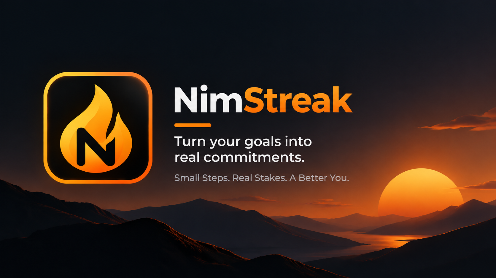
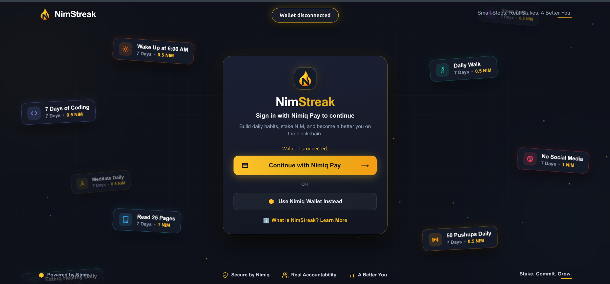
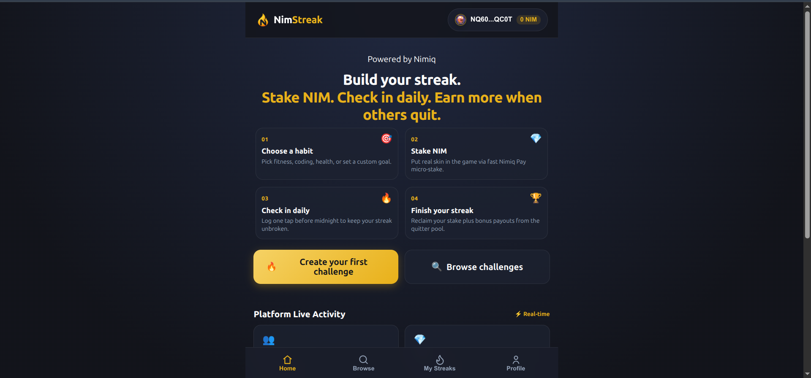
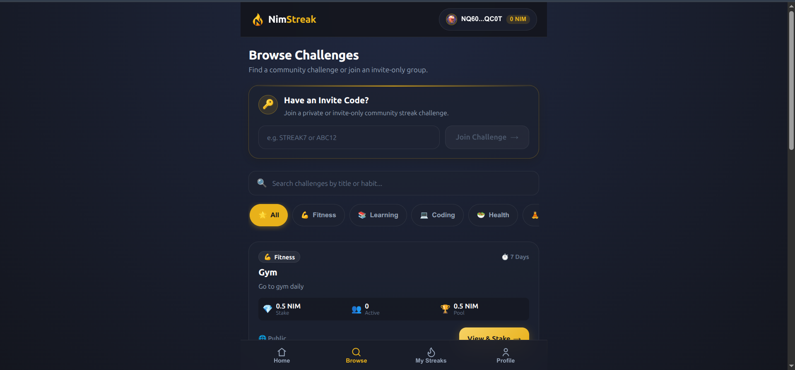
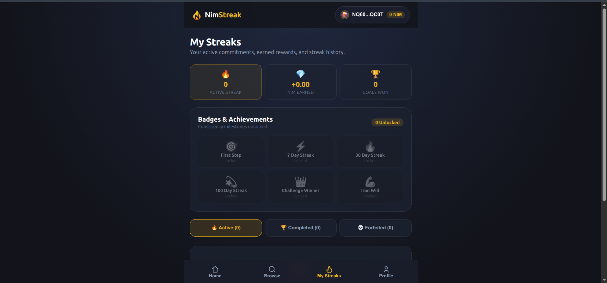
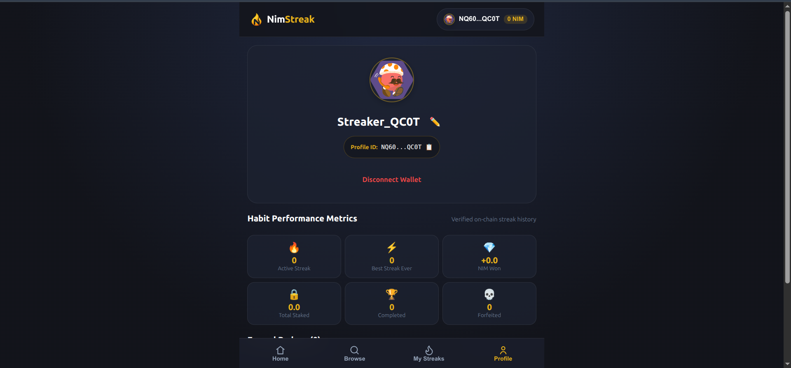

# NImstreak

> Small Steps. Real Stakes. A Better You.

| Field | Value |
| --- | --- |
| Category | Productivity |
| Pricing | Free |
| Team name | NimStreak |
| Team members | niceday miracle, miracle alajemba |
| X account | https://x.com/MiracleNic40883 |
| Heard about it via | x |
| Contact email | nicedaymiracle@gmail.com |
| GitHub login | @nicedaymiracle |
| Submitted at | 2026-09-13T03:28:19.396Z |

## Links

| Link | URL |
| --- | --- |
| Repo | [https://github.com/nicedaymiracle/nimstreak](<https://github.com/nicedaymiracle/nimstreak>) |
| Demo | [https://nimstreak.vercel.app](<https://nimstreak.vercel.app>) |
| Video | [https://youtu.be/J6KlcvjP0R4](<https://youtu.be/J6KlcvjP0R4>) |
| Skool post | [https://www.skool.com/miniappscompetition/nimstreak?p=65a88125](<https://www.skool.com/miniappscompetition/nimstreak?p=65a88125>) |
| Social post | [https://x.com/MiracleNic40883/status/2098594726769246240](<https://x.com/MiracleNic40883/status/2098594726769246240>) |

## Description

NimStreak is a habit accountability Mini App where users stake NIM on personal goals, check in daily, and build streaks. Finish your challenge to get your stake back and become eligible for rewards from participants who quit.

## Builder story

I first started thinking about NimStreak after attending a conference focused on how students manage their time, stay productive, and balance school with their personal goals. One thing really stood out to me: many students don't struggle because they don't know what they want to achieve they struggle with staying consistent enough to follow through.
As a university student myself, I could relate to that. I started talking about the idea with some of my university colleagues and realized that many of us were facing the same challenge. We would plan to study, code, exercise, read, learn new skills, or work on personal projects, but after a few days, motivation would drop and the habit would disappear.
But then I started thinking beyond the university environment. If students were struggling with consistency, surely people outside school were facing the same thing too. Whether it's exercising, learning a skill, reading, saving money, coding, or simply becoming more disciplined, staying consistent is something almost everyone can struggle with.

That made me ask: what if there was something real behind the commitment?
That question became NimStreak.
NimStreak lets users choose a habit, stake NIM through Nimiq Pay, and check in every day. Those who complete their challenge get their stake back and can become eligible for rewards from participants who quit.

But I also wanted NimStreak to make consistency feel less lonely. The experience goes beyond simply tracking your own streak. Users can see other streakers taking part in challenges, follow the progress of people working toward similar goals, and see that they are not the only ones putting something real behind their commitments.

Seeing other participants check in and build their streaks creates another layer of accountability. You are not just trying to keep a promise to yourself you are part of a group of people working toward their own goals alongside you. You can stake NIM alongside other streakers, see the challenge activity unfold, and watch progress build over time.

Building NimStreak has also been a learning journey for me. We had to solve real problems around Nimiq Pay, wallet identity, on-chain transaction verification, payout confirmation, and financial safety not just build something that looks good.
I built NimStreak together with my friend Miracle Alajemba, who introduced me to Nimiq and genuinely loves building. What started from a conversation about student productivity and consistency became a working Mini App designed around a problem that reaches far beyond the university.

At its heart, NimStreak is about helping people keep the promises they make to themselves one day, one check-in, one streak, and one community at a time.

Small Steps. Real Stakes. A Better You.

## Thumbnail

## Screenshots

---

_Generated from the submission form. `submission.yaml` in this folder is the machine-readable source of truth._
