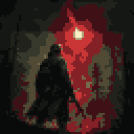
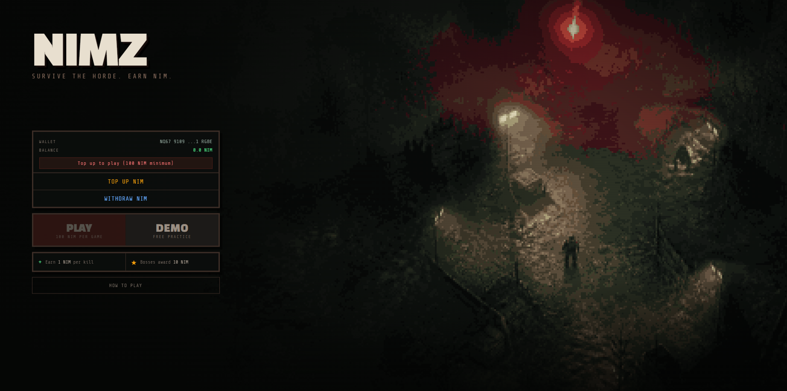
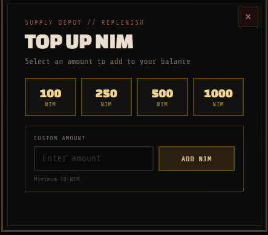
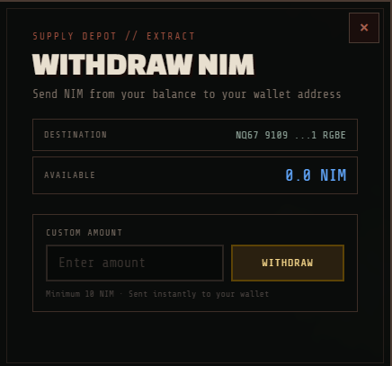
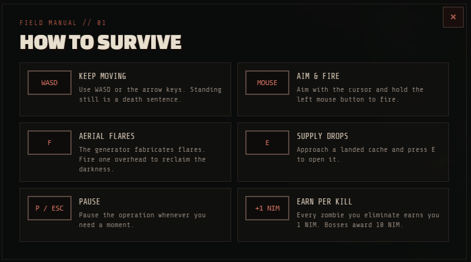
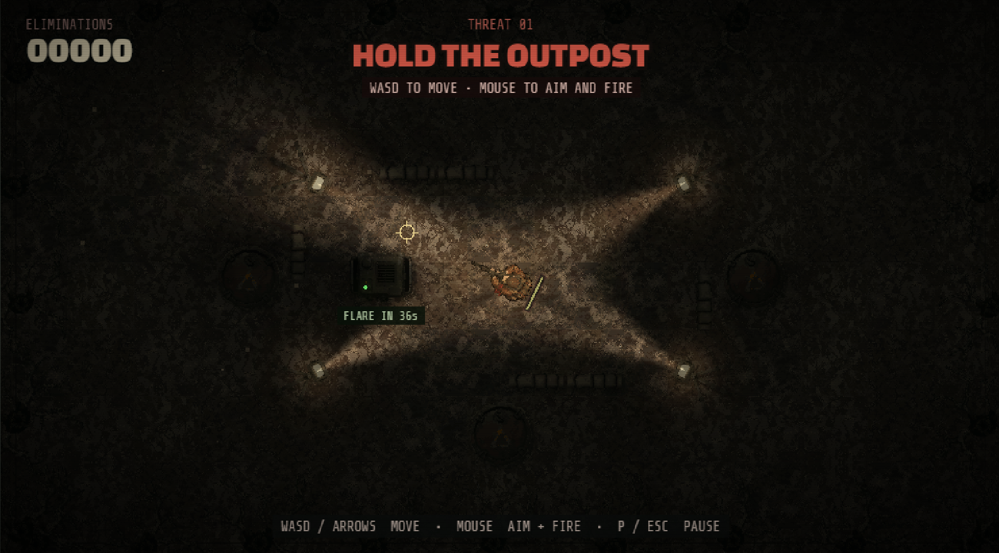

# NIMZ

> Survive the Horde. Earn NIM.

| Field | Value |
| --- | --- |
| Category | Games |
| Pricing | Freemium |
| Team name | _Not provided — optional_ |
| Team members | _Not provided — optional_ |
| X account | nimz_online |
| Heard about it via | twitter |
| Contact email | soapmaker1980@gmail.com |
| GitHub login | @nim-z |
| Submitted at | 2026-09-15T12:58:17.295Z |

## Links

| Link | URL |
| --- | --- |
| Repo | [https://github.com/nim-z/nimz](<https://github.com/nim-z/nimz>) |
| Demo | [https://nimz.online/](<https://nimz.online/>) |
| Video | [https://youtu.be/pIaLPULLu7U](<https://youtu.be/pIaLPULLu7U>) |
| Skool post | [https://www.skool.com/miniappscompetition/survive-the-horde-earn-nim?p=54d2b79c](<https://www.skool.com/miniappscompetition/survive-the-horde-earn-nim?p=54d2b79c>) |
| Social post | [https://x.com/nimz_online/status/2099825203912081484](<https://x.com/nimz_online/status/2099825203912081484>) |

## Description

A zombie survival shooter where you connect your Nimiq wallet, pay 100 NIM per game, and earn NIM for every zombie kill. Built for the Nimiq community with full Nimiq Pay + Hub API wallet integration and mobile touch controls.

## Builder story

Gaming was my entry point into crypto, but most blockchain games feel like spreadsheets with skins. I wanted something different — a game where the crypto is invisible. You connect your wallet, you play, you earn. No staking pools, no tokenomics diagrams, just pure gameplay with real rewards. NIMZ started as an open-source zombie shooter called TheLastLight. I integrated Nimiq Pay so players can connect their wallet in one tap on mobile, pay 100 NIM to enter, and earn NIM for every zombie they take down. The whole experience — from wallet connection to earning rewards — happens inside the Nimiq ecosystem. I built this because I believe the best crypto apps are the ones where you forget you're using crypto.

## Thumbnail

## Screenshots

---

_Generated from the submission form. `submission.yaml` in this folder is the machine-readable source of truth._
