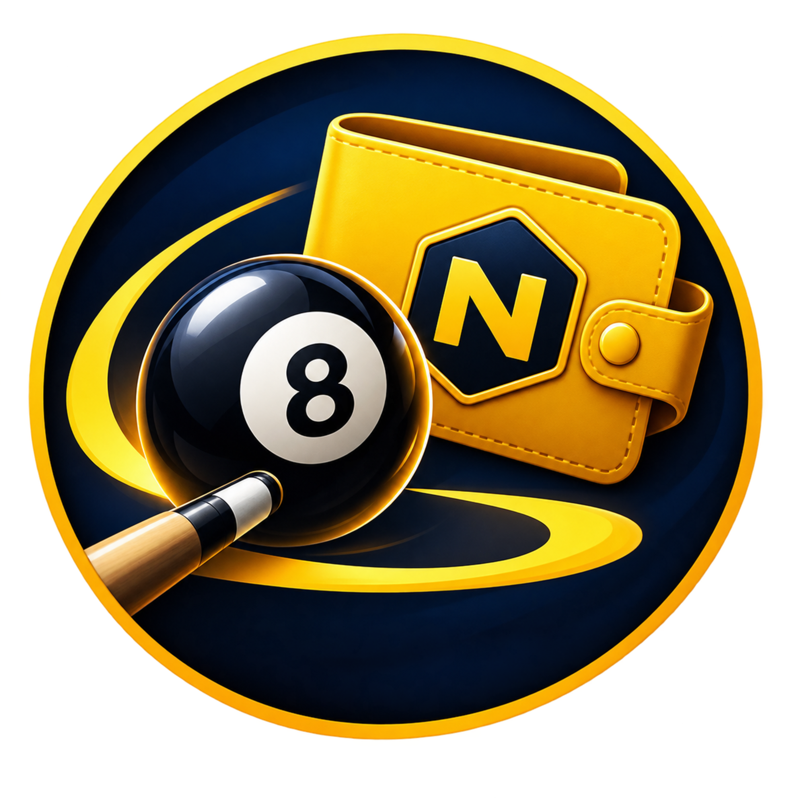
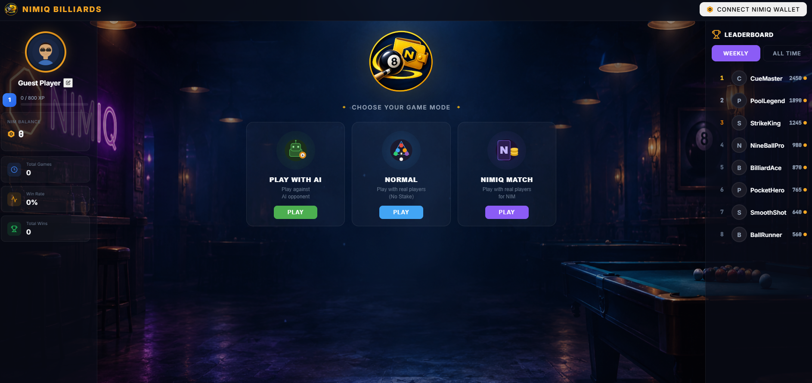
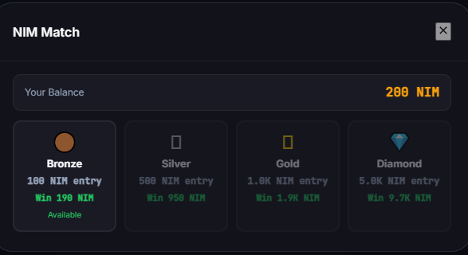
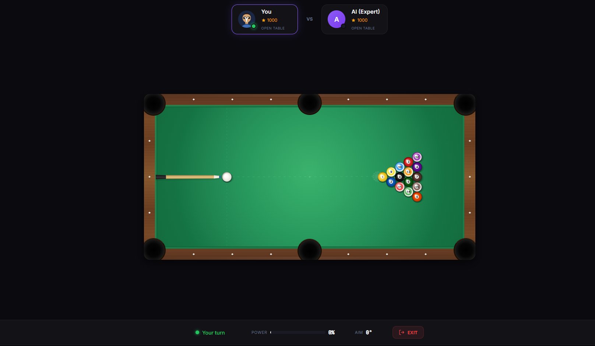

# Nimiq Billiards

> 8-ball pool for NIM — play friends, beat AI, earn crypto

| Field | Value |
| --- | --- |
| Category | Games |
| Pricing | Free |
| Team name | _Not provided — optional_ |
| Team members | _Not provided — optional_ |
| X account | nimiqbil |
| Heard about it via | X |
| Contact email | zhahahaahaa@gmail.com |
| GitHub login | @nimbil |
| Submitted at | 2026-09-13T21:18:35.763Z |

## Links

| Link | URL |
| --- | --- |
| Repo | [https://github.com/nimbil/nimiq-billiards](<https://github.com/nimbil/nimiq-billiards>) |
| Demo | [https://nimbil.up.railway.app/](<https://nimbil.up.railway.app/>) |
| Video | [https://youtu.be/X1u-InZlMMs](<https://youtu.be/X1u-InZlMMs>) |
| Skool post | [https://www.skool.com/miniappscompetition/nimiq-billiards-2?p=3a0d27b6](<https://www.skool.com/miniappscompetition/nimiq-billiards-2?p=3a0d27b6>) |
| Social post | [https://x.com/nimipdotspace/status/2099241574253187478](<https://x.com/nimipdotspace/status/2099241574253187478>) |

## Description

A real-time multiplayer 8-ball billiards game where you play against AI or compete head-to-head with other players for NIM tokens. Built for the Nimiq blockchain with native wallet integration.

## Builder story

I wanted to prove that blockchain gaming can be fun and accessible. Billiards is universal — everyone knows how to play. By combining real physics, multiplayer matchmaking, and Nimiq's fast/cheap transactions, I built a game where crypto is the reward, not the barrier. No gas fees eating your winnings, just pure competition.

## Thumbnail

## Screenshots

---

_Generated from the submission form. `submission.yaml` in this folder is the machine-readable source of truth._
