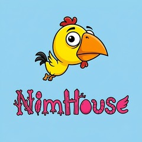
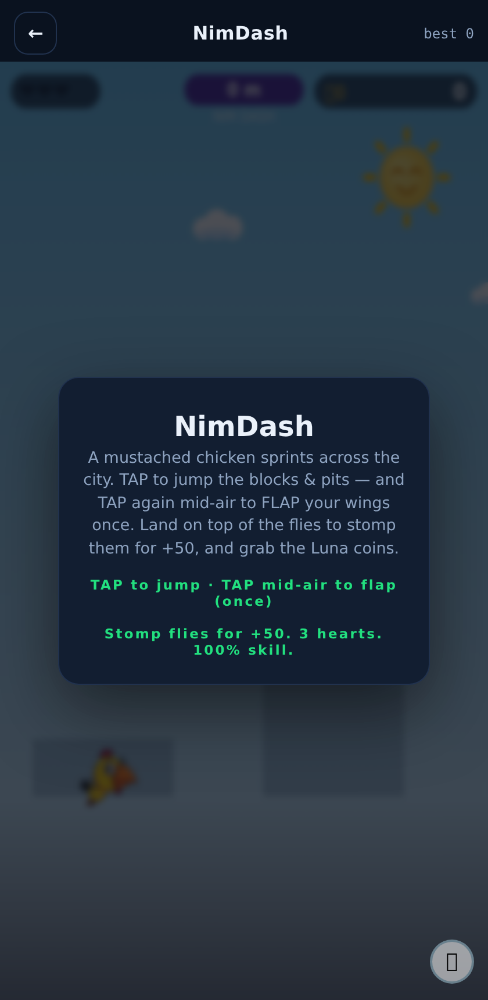
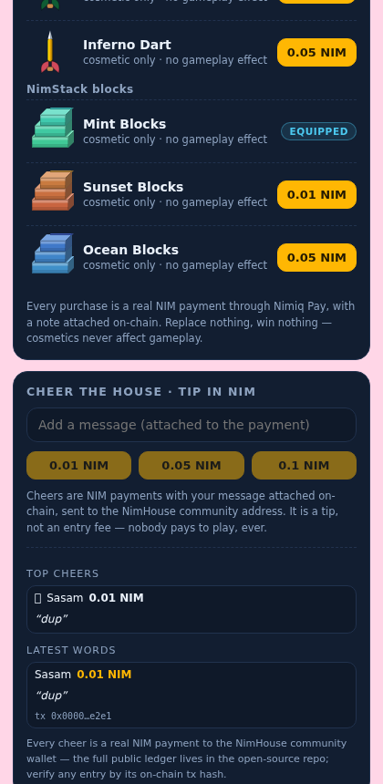
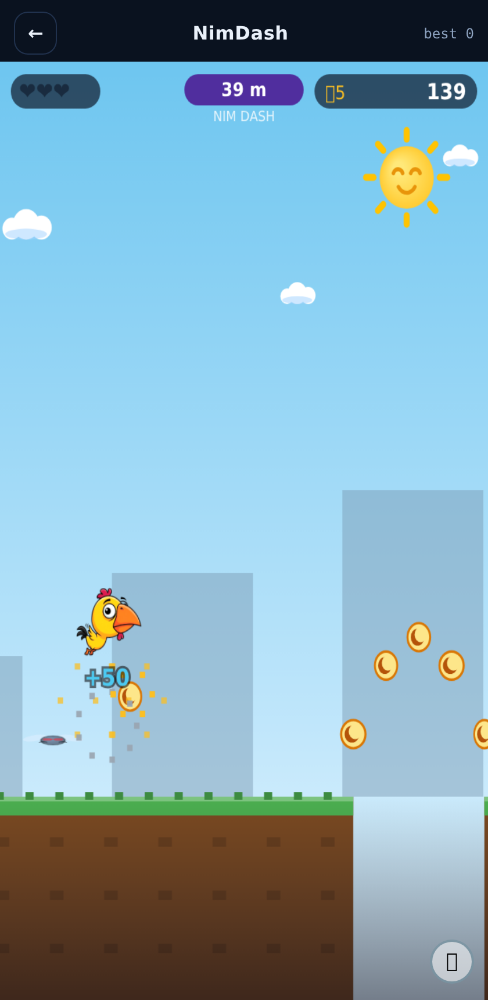
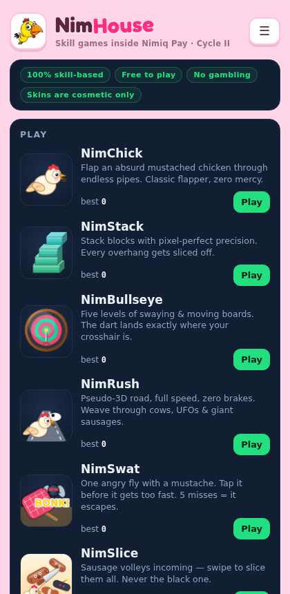

# NimHouse

> 7 skill games inside your Nimiq Pay wallet - free to play, no luck, no gambling.

| Field | Value |
| --- | --- |
| Category | Games |
| Pricing | Free |
| Team name | _Not provided — optional_ |
| Team members | _Not provided — optional_ |
| X account | onadeonft |
| Heard about it via | x |
| Contact email | weycatur@gmail.com |
| GitHub login | @sasam44 |
| Submitted at | 2026-09-13T18:24:54.087Z |

## Links

| Link | URL |
| --- | --- |
| Repo | [https://github.com/sasam44/nimhouse](<https://github.com/sasam44/nimhouse>) |
| Demo | [https://nimhouse.site](<https://nimhouse.site>) |
| Video | [https://youtu.be/IUWnGPp6ufM?si=too5RZSTDT4PWonN](<https://youtu.be/IUWnGPp6ufM?si=too5RZSTDT4PWonN>) |
| Skool post | [https://www.skool.com/miniappscompetition/nimhouse-free-to-play-skill-games-with-prize-cups-inside-nimiq-pay-and-why-its-clearly-not-gambling?p=cce6f6ce](<https://www.skool.com/miniappscompetition/nimhouse-free-to-play-skill-games-with-prize-cups-inside-nimiq-pay-and-why-its-clearly-not-gambling?p=cce6f6ce>) |
| Social post | [https://x.com/onadeonft/status/2099197075389026515?s=20](<https://x.com/onadeonft/status/2099197075389026515?s=20>) |

## Description

NimHouse is a hub of 7 original skill-based games that live inside your Nimiq Pay wallet — flappy, stacking, bullseye, pseudo-3D driving, volleys, and a tap-to-flap platformer. It's free to play: submit wallet-signed scores to 3-day NIM prize cups, buy cosmetic-only skins, and ch

## Builder story

I built NimHouse because I wanted games that are actually part of the wallet, not a logo bolted onto a webpage. The problem I'm solving: most mini-app "games" are either pay-to-play or games of chance, so I built the opposite , seven fully skill-based games where nothing can be bought and nothing can be won by luck. The wallet sits at the center: scores are signed by your key (tamper-proof), names are claimed with a signature, cheers are real NIM transactions carrying your own message on a public board, and every cup pool and payout is written to a public repo anyone can audit. Free to play is a promise, not a pricing tier , nobody pays a cent to compete, and only skill decides the podium.

## Thumbnail

## Screenshots

---

_Generated from the submission form. `submission.yaml` in this folder is the machine-readable source of truth._
