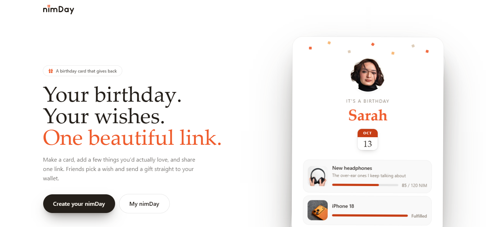
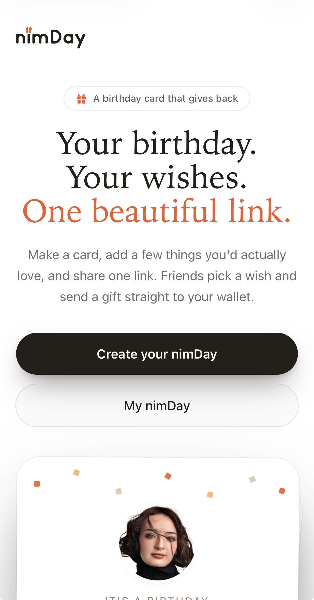
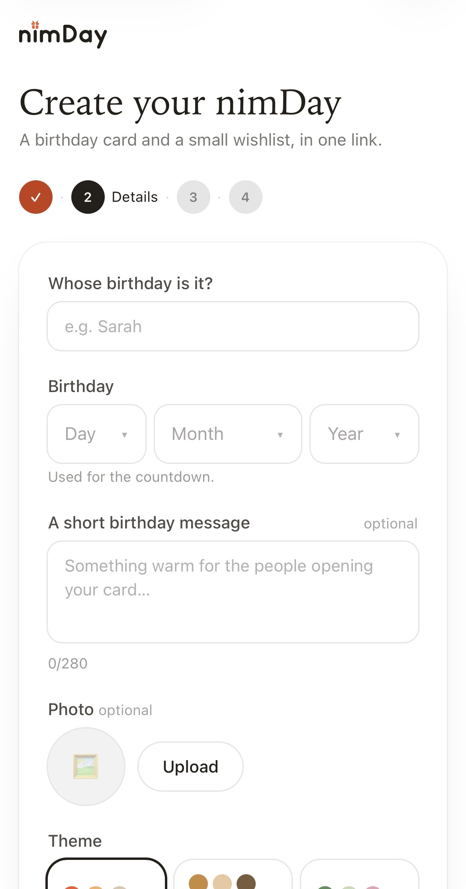
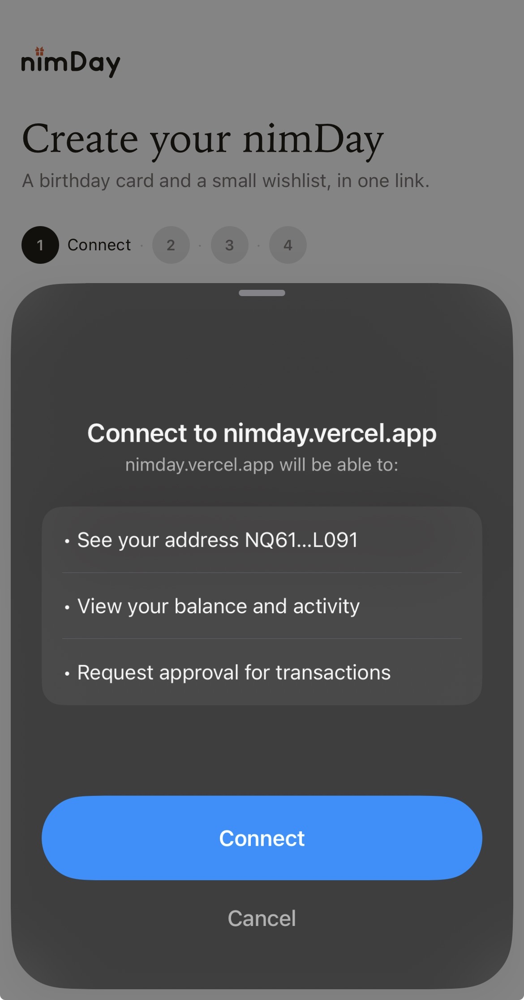
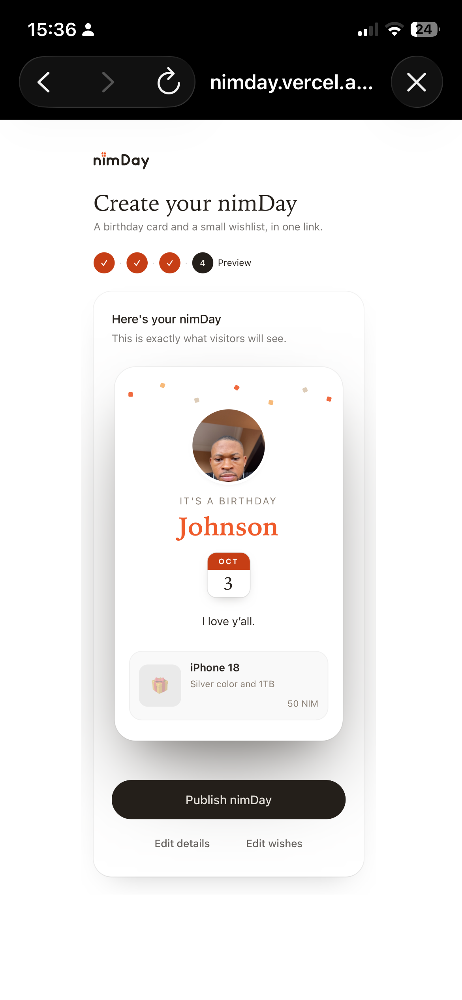
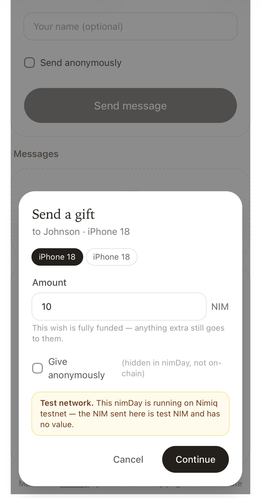

# nimDay

> Your birthday. Your wishes. One beautiful link.

| Field | Value |
| --- | --- |
| Category | Earning |
| Pricing | Free |
| Team name | _Not provided — optional_ |
| Team members | _Not provided — optional_ |
| X account | sniperchief_001 |
| Heard about it via | I heard about Nimiq on X |
| Contact email | purestaiuser@gmail.com |
| GitHub login | @sniperchief |
| Submitted at | 2026-09-13T15:23:02.216Z |

## Links

| Link | URL |
| --- | --- |
| Repo | [https://github.com/sniperchief/NIMDAY](<https://github.com/sniperchief/NIMDAY>) |
| Demo | [https://nimday.vercel.app/](<https://nimday.vercel.app/>) |
| Video | [https://www.youtube.com/shorts/2GlVC5BXkFQ](<https://www.youtube.com/shorts/2GlVC5BXkFQ>) |
| Skool post | _Not provided — optional_ |
| Social post | [https://x.com/sniperchief_001/status/2099153756575220042?s=20](<https://x.com/sniperchief_001/status/2099153756575220042?s=20>) |

## Description

nimDay turns your birthday into one beautiful link: a card with your wishlist where friends can leave a message and send NIM straight to your wallet through Nimiq Pay. Built for anyone celebrating a birthday, and for the friends who never know what to get them.

## Builder story

I built nimDay around a simple idea: birthdays should make gifting easier, not more complicated.

Usually, if I want to get a friend something they actually want, I have to ask, guess, find a product link, or send money and hope they use it for something they like. For the person celebrating, sharing what they want can feel just as awkward.

nimDay turns that into one simple experience: create a beautiful birthday card, add the things you actually want, and share one link with your friends. They can see your wishes, leave a birthday message, and send NIM directly to you when they want to contribute toward a gift.

I wanted NIM to feel like part of a useful everyday experience rather than something people have to understand before they can use it. nimDay doesn't hold anyone's money or require a complicated crypto workflow—the gift goes directly from the giver's Nimiq wallet to the birthday person's wallet, while nimDay verifies the payment and updates the wish.

The result is a birthday card, wishlist, and gifting experience in one place.

## Thumbnail

## Screenshots

---

_Generated from the submission form. `submission.yaml` in this folder is the machine-readable source of truth._
