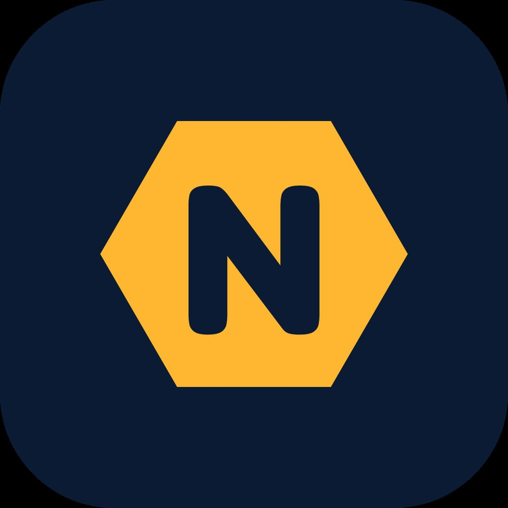
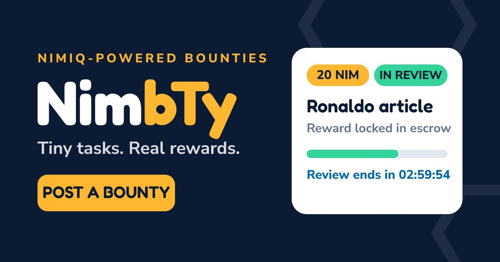
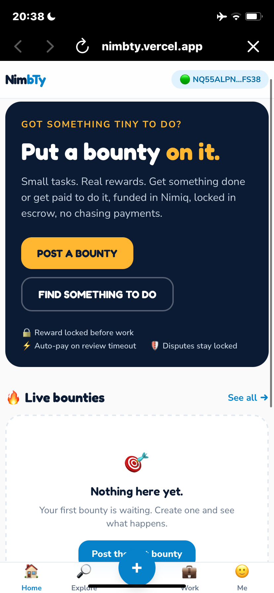
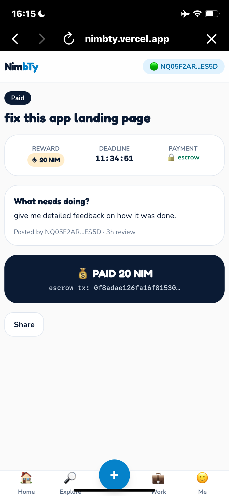
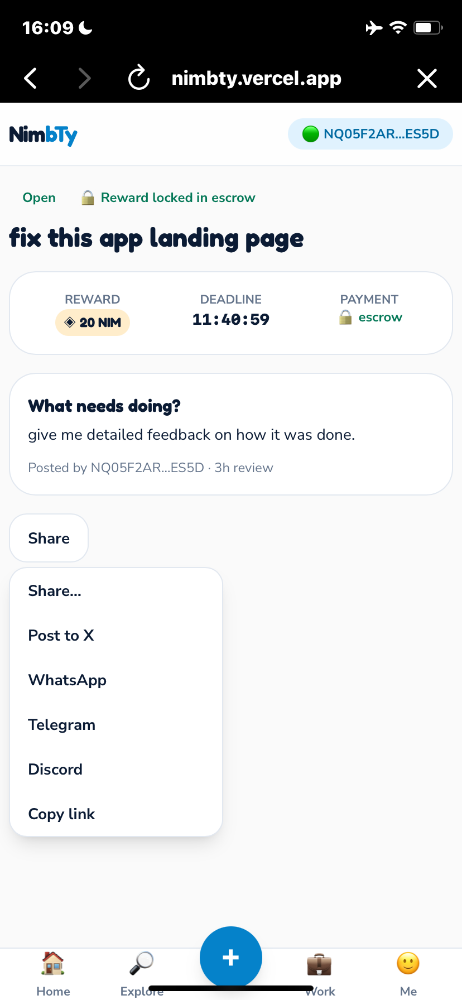
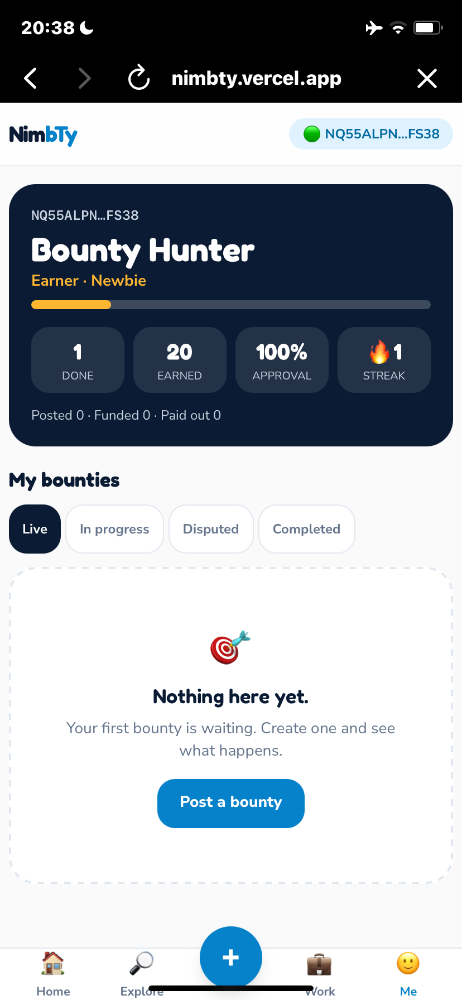
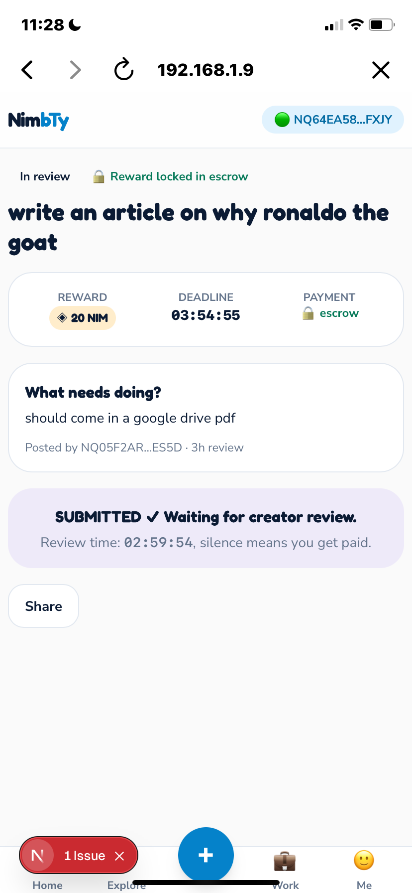

# NimbTy

> Small tasks. Real pay. On Nimiq

| Field | Value |
| --- | --- |
| Category | Marketplaces |
| Pricing | Free |
| Team name | _Not provided — optional_ |
| Team members | _Not provided — optional_ |
| X account | uyscuttyy |
| Heard about it via | X |
| Contact email | oyedokuntominiyi1234@gmail.com |
| GitHub login | @uyscuttyy |
| Submitted at | 2026-09-14T20:31:06.662Z |

## Links

| Link | URL |
| --- | --- |
| Repo | [https://github.com/uyscuttyy/NimbTy](<https://github.com/uyscuttyy/NimbTy>) |
| Demo | [https://nimbty.vercel.app/](<https://nimbty.vercel.app/>) |
| Video | [https://youtube.com/shorts/cSsZuBID1r0?si=kWjMIB0C8F8gbPSG](<https://youtube.com/shorts/cSsZuBID1r0?si=kWjMIB0C8F8gbPSG>) |
| Skool post | [https://www.skool.com/miniappscompetition/nimbty-is-live-micro-bounties-on-nimiq-pay?p=6d513ab4](<https://www.skool.com/miniappscompetition/nimbty-is-live-micro-bounties-on-nimiq-pay?p=6d513ab4>) |
| Social post | [https://x.com/uyscuttyy/status/2099224091555221668?s=46](<https://x.com/uyscuttyy/status/2099224091555221668?s=46>) |

## Description

NimbTy is a micro-task marketplace on Nimiq Pay. Post a small job, lock the reward, someone completes it, you approve, and payment releases. Built for quick work that doesn’t belong on big freelance platforms.

## Builder story

i’m broke, got no money .. so i’m just looking for a way for people with no money to make some money

## Thumbnail

## Screenshots

---

_Generated from the submission form. `submission.yaml` in this folder is the machine-readable source of truth._
